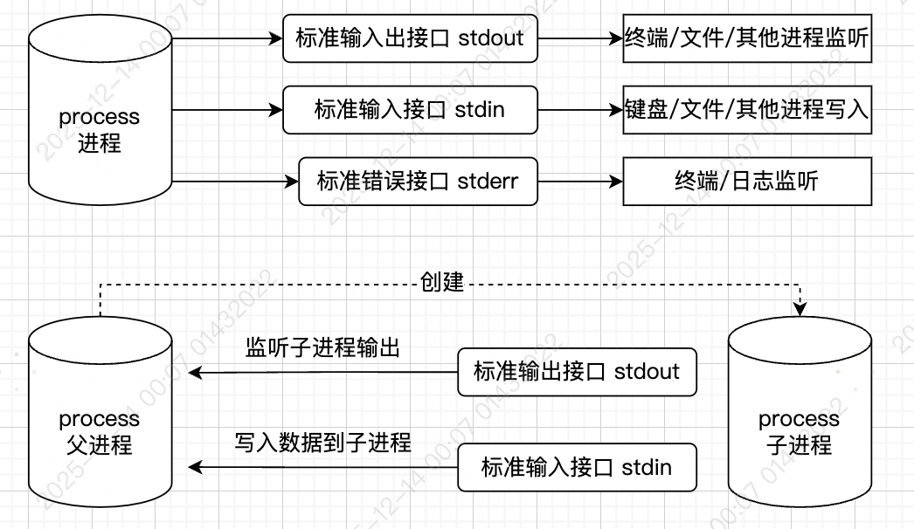
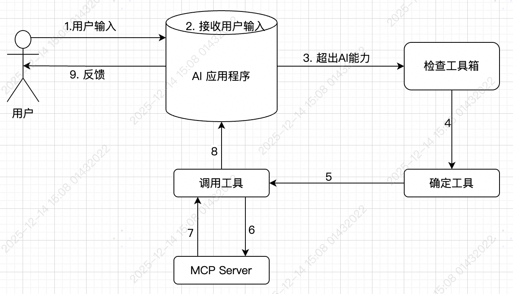
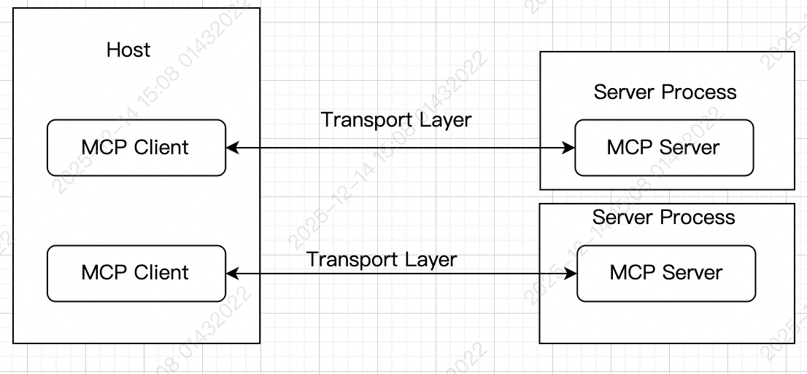

### 前置知识

#### 通信方式 -- stdio（本地） / http（可远程）

##### stdio: 标准输出输入

> 特点：简单、高效、仅适用于本地进程通信



#### 通行格式 -- JSON-RPC


### MCP 

#### 定义
**MCP：模型上下文协议，是一种标准协议，用于规定应用程序之间是如何通信**

官方地址：https://modelcontextprotocol.io/docs/learn/architecture

认识过程
- 技术层面：实现细节
- 功能层面：应用场景

#### 如何通信

- 通信方式：stdio (本地) / http (可远程)
- 通信格式：基于JSON-RPC的进一步规范

#### 基本规范

##### 1. 初始化 initialze

**`request`**

```json
{
  "jsonrpc": "2.0",
  "id": 1,
  "method": "initialize", // 固定 initialize
  "params": {
    "protocolVersion": "2025-06-18",
    "capabilities": {
      "elicitation": {}
    },
    "clientInfo": { // 告知服务器客户端信息
      "name": "example-client",
      "version": "1.0.0"
    }
  }
}
```

**`response`**

```json
{
  "jsonrpc": "2.0",
  "id": 1,
  "result": {
    "protocolVersion": "2025-06-18",
    "capabilities": {
      "tools": {
        "listChanged": true
      },
      "resources": {}
    },
    "serverInfo": {
      "name": "example-server",
      "version": "1.0.0"
    }
  }
}
```

##### 2. 工具发现 (tools/list)

**服务器有哪些工具函数可以提供给客户端使用**

**`request(tools/list)`**

```json
  {
    "jsonrpc": "2.0",
    "id": 2,
    "method": "tools/list"
  }
```

**`response`**
```json
  {
  "jsonrpc": "2.0",
  "id": 2,
  "result": {
    "tools": [
      {
        "name": "calculator_arithmetic",
        "title": "Calculator", // 必填
        "description": "Perform mathematical calculations including basic arithmetic, trigonometric functions, and algebraic operations", // 必填
        "inputSchema": {
          "type": "object",
          "properties": {
            "expression": {
              "type": "string",
              "description": "Mathematical expression to evaluate (e.g., '2 + 3 * 4', 'sin(30)', 'sqrt(16)')"
            }
          },
          "required": ["expression"]
        }
      },
      {
        "name": "weather_current",
        "title": "Weather Information",
        "description": "Get current weather information for any location worldwide",
        "inputSchema": {
          "type": "object",
          "properties": {
            "location": {
              "type": "string",
              "description": "City name, address, or coordinates (latitude,longitude)"
            },
            "units": {
              "type": "string",
              "enum": ["metric", "imperial", "kelvin"],
              "description": "Temperature units to use in response",
              "default": "metric"
            }
          },
          "required": ["location"]
        }
      }
    ]
  }
}
```

##### 3. 工具调用 （tools/call）

**`request(tools/call)`**

```json
{
  "jsonrpc": "2.0",
  "id": 3,
  "method": "tools/call",  // 调用工具
  "params": {
    "name": "weather_current", // 工具名，对应工具发现中的name
    "arguments": {
      "location": "San Francisco", // 工具参数，需要和工具发现中的结构一致
      "units": "imperial" // 工具参数，需要和工具发现中的结构一致
    }
  }
}
```

**`response`**

```json
{
  "jsonrpc": "2.0",
  "id": 3,
  "result": {
    "content": [ // 函数结构需要放到 content 字段中，如果多个，使用数组
      {
        "type": "text", // 函数结果类型
        "text": "Current weather in San Francisco: 68°F, partly cloudy with light winds from the west at 8 mph. Humidity: 65%"
      }
    ]
  }
}
```
函数结果支持的类型：https://modelcontextprotocol.io/specification/2025-06-18/server/tools#tool-result


#### 高效工具

##### MCP server 的调试工具

运行一下命令，打开一个MCP客户端
```bash 
  npx @modelcontextprotocol/inspector
```

##### MCP SDK
用来解决服务端编写麻烦的问题
使用`@modelcontextprotocol/sdk`可以更方便的开发`MCP server`
```bash
  npm install @modelcontextprotocol/sdk
```

###### zod

#### 对接AI应用程序
所有能与大模型交互的应用都可以看作是AI应用程序。

常见的AI应用程序：
- ChatGPT
- DeepSeek Chat Page
- Cluade Desktop，支持MCP协议，可充当MCP客户端：https://claude.ai/download
- VScode 支持MCP协议，可充当MCP客户端
- Cursor 支持MCP协议，可充当MCP客户端
- ...

`大模型调用MCP过程`



##### 两个核心概念

1. `MCP Host`：往往指代AI应用程序本身，用于发现`MCP Server`以及其中的工具列表
2. `MCP Client`：用于和`MCP Server`通信的客户端，往往在Host内部开启，通常情况启动一个MCP Server，就会启动一个MCP Client。
   


#### 重新认识MCP

> MCP，全称 Model Context Protocol，模型上下文协议。其旨在为AI与外部程序之间建立通信标准，从而使得外部程序可以被部署到任意AI，也使得AI应用程序可以使用任意程序。

#### MCP资源聚合平台
- 官方：https://github.com/modelcontextprotocol/servers
- https://mcpservers.org/
- https://mcp.so
- 中文：https://modelscope.cn/mcp

#### 项目实战

##### 安全依赖审计工具

**`什么事安全依赖审计`**

安全依赖审计是指对某个工程所有直接依赖和间接依赖进行安全验证，发现其是否包含潜藏的风险。

**`何时会进行安全依赖审计`**

- 技术选型
  - 针对目标技术
  - 远程审计
- 项目开发
  - 针对当前工程
  - 本地审计/远程审计

**`如何进行安全审计`**
```bash
  npm audit
```

**`为什么不直接使用 npm audit`**

**npm audit的问题**
- 阅读不友好
  - 依赖关系不清晰
- 功能不完整
  - 无法对远程仓库进行审计
  - 无法对工程本身进行审计（只能审计依赖）
- 难以集成
  - AI应用集成：取决于应用是否支持运行命令
  - CI/CD集成：无法定义部署决策逻辑
  
**`需求`**

自定义安全审计功能，该功能可以支持：
- 对本地工程货远程仓库均能进行安全审计
- 安全审计时能够对工程本身进行审计
- 审计结果中包含清晰的依赖路径
- 审计的结果是一个统一标准的**markdown**格式文档
- 支持**MCP Server**协议

**`MVP 版本实现流程`**

大致分为两个部分功能：
1. 实现安全审计功能本身

```js
/**
 * 根据项目根目录，审计项目中所有的包（包含目录本身）
 * @param {string} projectRoot 项目根目录，可以是本地目录的绝对路径，也可以是远程仓库URL
 * @param {string} savePath 保存审计结果的文件名，审计结果是一个标准格式的markdown字符串
 */
export async function auditPackage(projectRoot, savePath) {}
```

2. 将该功能套壳为 `MCP Server`

**`安全审计功能的实现流程`**
1. **创建工作目录：**创建一个临时的工作目录，用于保存执行期间要用到的临时文件
2. **解析工程：**解析本地工程目录或者远程仓库链接，得到对应的package.json文件内容
3. **生产lock文件：**将package.json写入到临时工作目录，同时根据它生成package-lock.json
4. **安全审计：**进入临时工作目录，使用`npm audit`命令进行安全审计，并将审计结果规格化
5. **渲染：**将上一步得到的规格化审计结果进行渲染，渲染出标准的markdown内容，并保存到结果文件
6. **删除工作目录：**将之前创建的临时工作目录删除


**`实现细节`**
1. **创建工作目录**：创建一个临时工作目录，用于保存执行期间要用到的临时文件
  - 如何保证目录名的唯一性：随机字符串 + 时间戳、UUID
2. **解析工程**：解析本地工程目录或者远程仓库链接，得到对应工程的package.json文件内容
  - 分辨是本地工程还是远程仓库
  - 具体何种远程仓库（MVP版本仅考虑GitHub仓库）
  - 如何从远程仓库链接中分析得到关键信息：owner、repo、tag、default_branch
  - 如何获取远程仓库中的package.json
  - 其他情况处理（MVP版本不涉及）：非前端工程、monorepo工程
3. **生成lock文件**：将package.json写入临时工作目录，同时根据它生成package-lock.json
  - 如何根据package.json生成lock文件： `npm install --package-lock-only`
4. **安全审计**：进入到临时目录下，使用`npm audit`命令进行安全审计，并把安全审计结果规格化
  - 如何得到审计结果：`npm audit --json`
  - 审计结果中包含哪些信息
    - severity(定义漏掉级别：严重、高、中、低)：https://docs.npmjs.com/about-audit-reports#severity
    - source：npm对漏洞的编号，仅存在于npm包中的漏洞
    - CVE：漏洞的通用编号，该编号跨越语言，可以从（https://www.cve.org）查询详情
    - CWE：漏洞类型编号，通过此编号可以找到漏洞是如何产生的，会造成什么影响，可以通过（https://cwe.mitre.org）进行查询
    - CVSS：漏洞严重性评分，对应severity字段
  - 规格化的目标
    - via: 存在哪些漏洞
    - effects：影响哪些依赖它的包
  - 如何规格化：图的DFS算法，把图转换成依赖顺序
  - 如何获取当前工程的审计结果： npm的远程API
  - 把当前工程的审计结果汇总到结果中
5. **渲染**：将上一步得到的规格化结果进行渲染，渲染成标准化的markdown内容，并保存到结果文件
  - 如何将审计结果渲染为markdown：使用模版引擎（ejs）、此项目就用ejs
6. **删除工作目录**：将之前创建的临时工作目录删除

**`MCP 套壳`**

1. 启动一个MCP服务，`@modelcontextprotocol/sdk`为例
2. 注册一个工具，工具的各种参数（title、name、descript....）

**`MCP Server 代码`**

```js
import { McpServer, ResourceTemplate } from "@modelcontextprotocol/sdk/server/mcp.js";
import { StdioServerTransport } from "@modelcontextprotocol/sdk/server/stdio.js";
import { z } from "zod";
import {auditPackage} from './entry/index.js'

// 创建MCP服务器
const server = new McpServer({
  name: "audit-server",
  title: '前端工程安全审计服务',
  version: "1.0.0",
});

// 添加加法工具
server.registerTool("auditPackage",
  {
    title: "审计前端工程",
    description: "审计前端工程的所有直接和间接依赖，得到安全审计结果。支持本地工程的审计，也支持远程仓库的审计。审计结果为标准的markdown字符串，不用修改，直接用于展示即可。",
    inputSchema: { 
      projectRoot: z.string().describe('本地工程的根路径，或者远程仓库的URL地址'),
      savePath: z.string().describe('保存审计结果的路径，传递当前工程的根目录下的工程名audit.md，如果没有当前工程，则传递桌面路径下的audit.md（注意，桌面路径必须穿入绝对路径）')
    }
  },
  async ({ projectRoot, savePath }) => {
    await auditPackage(projectRoot, savePath);
    return {
      content: [
        {
          type: "text",
          text: `审计完成，结果已保存到：${savePatn}`
        }
      ]
    }
  }
);

// 添加动态问候资源
server.registerResource(
  "greeting",
  new ResourceTemplate("greeting://{name}", { list: undefined }),
  { 
    title: "问候资源",
    description: "动态问候生成器"
  },
  async (uri, { name }) => ({
    contents: [{
      uri: uri.href,
      text: `你好，${name}！`
    }]
  })
);

// 通过标准输入输出接收和发送消息
const transport = new StdioServerTransport();
await server.connect(transport);
```