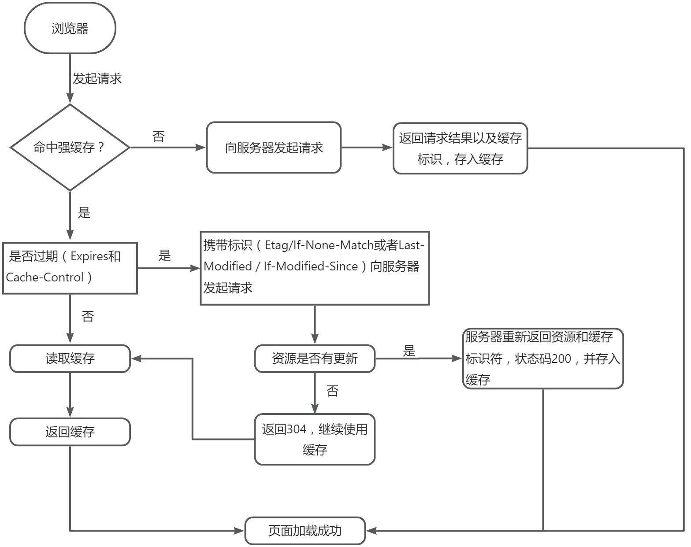

### 缓存机制流程图

### 缓存过程分析

- 过程描述
> 1. 第一次请求，浏览器直接向服务器发送请求拿到返回结果，并将缓存标识存入浏览器缓存，加载页面成功
> 2. 当浏览器再次访问已经访问过的资源，它会：
> - 看是否命中强缓存，如果命中，直接使用强缓存，
> - 如果没有命中强缓存，就发送请求到服务器检查是否命中协商缓存，
> - 如果命中协商缓存，返回304告诉浏览器使用本地缓存，
> - 如果没命中协商缓存，则返回新资源，并将获取的请求结果再存入浏览器缓存中。

- 是否要向服务器重新发起http请求，先了解两个东西：强缓存和协商缓存

#### 强缓存
`浏览器不向服务器发送任何请求，直接从本地缓存读取文件并返回status code 200`

- 控制强缓存的字段
> 1. Expires：是HTTP/1.0控制网页缓存的字段，其值为服务器返回该请求结果缓存的到期时间，即在此发送请求，如果客户端的时间小于Expires值时，直接使用缓存结果。
> 2. Cache-Control：HTTP/1.1中，控制页面缓存的字段。优先级高于Expires。

- `Expires`和`Cache-control`两者对比：

`Expires`的时间是一个绝对值，而`Cache-control`中的`max-age`是一个相对值。`Cache-Control`优先级高于`Expires`。

- `Cache-control`替代`Expires`的原因
> `Expires`的控制原理是将使用客户端时间与服务器返回的时间作对比，但是如果客户端和服务器的时间因为某些原因产生误差，如时区不同，那么强缓存就会失效。

#### 协商缓存
`
协商，就是与服务器协商的意思，向服务器发起请求，服务器会根据这个请求的request header的一些参数判断是否命中缓存，如果命中，则返回304状态码并带上新的response header通知浏览器从缓存读取资源。
`

- 控制协商缓存的字段
> 1. Last-Modified / If-Modified-Since
> - Last-Modified：是服务器响应请求时，返回该资源文件在服务器最后被修改的时间
> - If-Modified-Since：是客户端再次发起请求时，携带上次请求返回的`Last-Modified`值，通过此字段告诉服务器该资源上次请求返回的最后修改时间。服务器收到该请求，发现请求头含有If-Modified-Since字段，则会根据If-Modified-Since的字段值与该资源在服务器的最后被修改时间对比，如果服务器的资源最后被修改时间大于If-Modified-Since字段的值，则重新返回资源，状态码为200，否则返回304，代码资源无更新，可继续使用缓存文件。
> 2. Etag / If-None-Match
> - Etag：是服务器响应请求时，返回当前资源文件的一个唯一标识（由服务器生成）
> - If-None-Match：是客户端再次发起请求时，携带上次请求返回的唯一标识Etag值，通过此字段值告诉服务器该资源上次请求返回的唯一标识值。服务器收到请求后，发现该请求头中含有If-None-Match，则会根据If-None-Match的字段值与该资源在服务器的Etag值做对比，一致则返回304，代表资源无更新，继续使用缓存中的资源，不一致则重新返回资源文件，状态码是200

`
从优先级上看，Etag/If-None-Match的优先级高于Last-Modified/If-Modified-Since
`
### 浏览器把资源存到哪里？

- memory cache

`
memory cache 就是将资源缓存到 **内存** 中，等待下次访问时不需要重新下载资源，而是直接在内存中获取。关闭浏览器后，数据将不存在（被释放掉了），再次打开页面，不会再出现 from memory cache
`

- disk cache

`
dis cache 就是将资源缓存到 **硬盘 **中，等待下次访问时不需要重新下载资源，而是直接在硬盘中获取。关闭浏览器后，数据不会丢失，此资源不会随着页面的关闭而被释放掉，下次打开仍然会是 from disk cache
`

### 缓存的作用

1. 再次访问资源是重复使用，节省带宽
2. 提高访问速度
3. 降低服务器压力

### 扩展知识

1. 当ctrl+f5强制刷新网页时，直接从服务器加载，跳过强缓存和协商缓存。
2. 当f5刷新网页时，跳过强缓存，但是会检查协商缓存。
3. 浏览器地址栏输入URL，回车，浏览器发现缓存中有这个文件了，不用继续请求，直接使用缓存。
