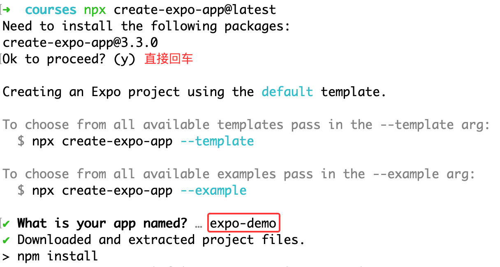
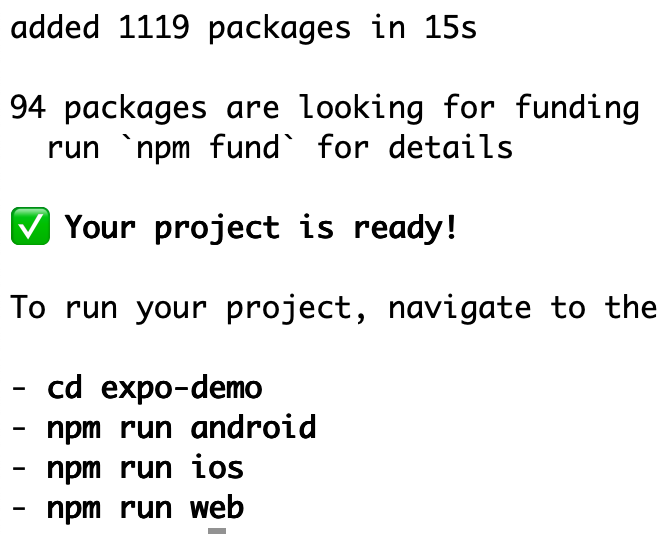
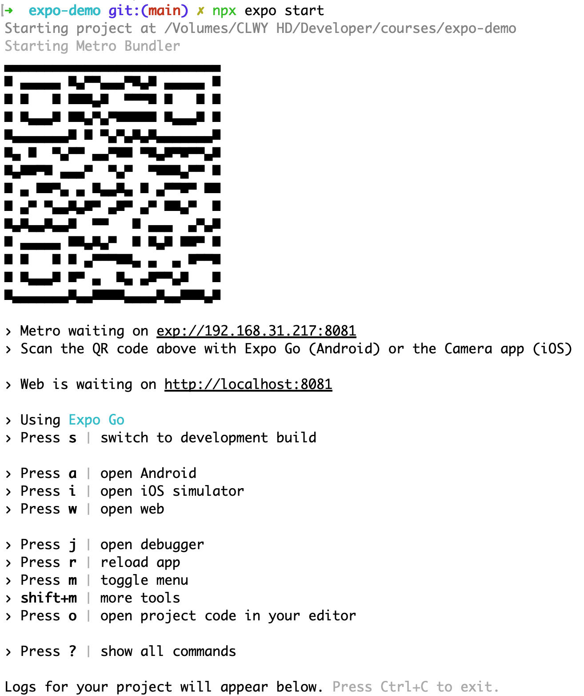
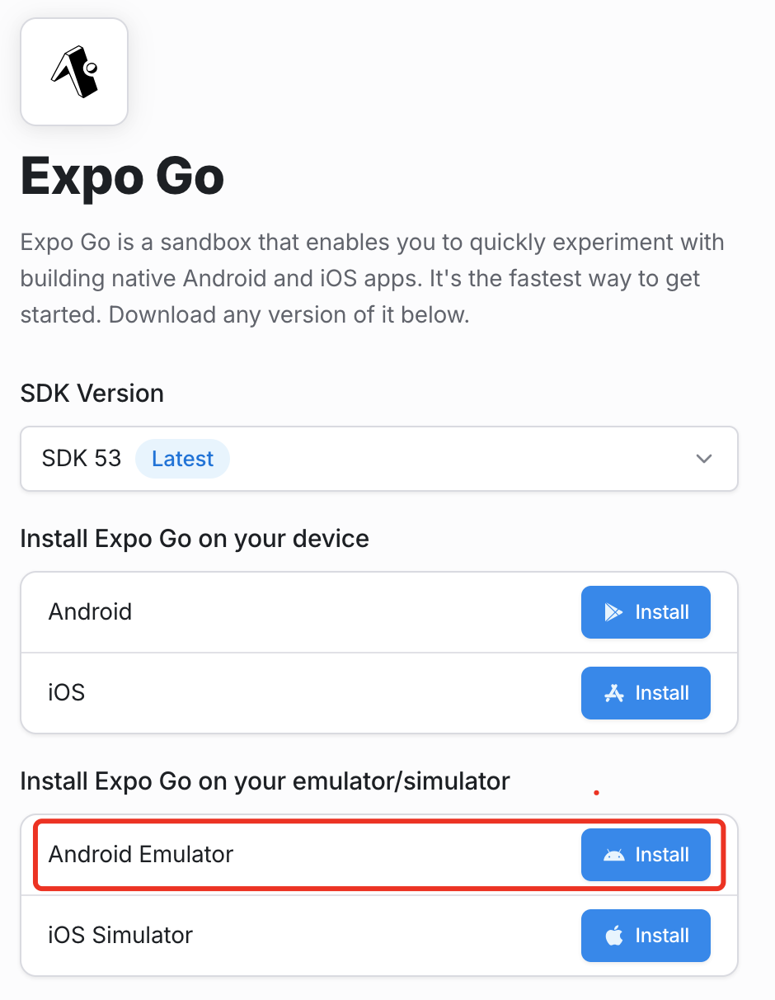
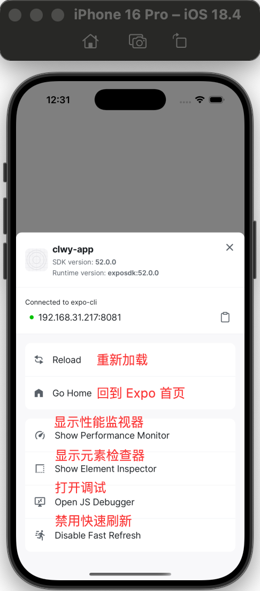

### 入门介绍
- 原生APP：`开发成本高，但是体验好`
  - 开发IOS，需要使用Objective-C或Swift。
  - 开发Android，需要使用Java或Kotlin。
  - 开鸿蒙，需要使用ArkTS。
  
- Web App：通过把web打包成APP，常见的有uni-app。`开发成本低，体验稍逊色`。

### 跨平台方案

#### React Native
> 实现原理：使用就是React框架，去调用Java、Swift等语言写的原生组件，去开发App。因为所使用的组件，都是原生的。所以这样做，就可以达到接近原生的性能了。

- 在移动端，支持Android和iOS和鸿蒙（有社区提供支持）。
- 在桌面端，支持Windows（需要微软提供支持）、MacOS。

#### Flutter
> 实现原理：Flutter基于谷歌自己的Dart语言开发，通过自绘引擎实现原生级性能。它不依赖平台的原生组件，而是自己实现了一套跨平台的 UI 渲染方案。

- 在移动端，支持Android和iOS和鸿蒙（有社区提供支持）。
- 在桌面端，支持Windows（需要微软提供支持）、MacOS。

##### 存在的问题
- 要学习Dart语言，这个就让人很烦。我就懒得学习新语言，对我来说，最好是前后端、移动端，全都用JS。
- Dart的代码风格让人非常难受，如果代码优化的不好，喜得美名嵌套地狱

#### 其他 uni-app

### 开发环境搭建

#### Expo 开发环境搭建

##### 安装Node.js

Node.js的版本，请使用最新的LTS版本，不要用一些特别老的版本。

##### 安装Expo CLI

##### 创建项目

也不需要安装什么，用npx命令，就可以直接创建React Native项目，大家跟着我一起运行命令：
```shell
  npx create-expo-app@latest
```



- 它会问我们，是否安装，当然`yes`。不用输入`y`，直接按回车键就好。
- 接着问我们项目名称，输入：`expo-demo`，继续回车。
- 


等待命令运行完成，用`cd`命令，进入项目目录。
```shell
  cd expo-demo
```

##### 运行项目
```shell
  npx expo start
```

- 这里出来了一个二维码，还有一些快捷键说明。
- 到这里了，就不要乱按了，也不要关闭这个窗口。

##### 真机预览

- i**os**
  - 进入App Store中，搜索Expo Go，找到后直接安装。
  - 确保iPhone与电脑连的是同一个Wi-Fi，是在同一个局域网中的。
  - 用iPhone的相机应用扫这个二维码，注意是系统自带的相机。
  - 如果一直扫不到也没关系，命令行中给了个链接：将exp开头的这个链接地址复制了，用iPhone自带的Safari浏览器直接访问，也可以打开预览

- **android**
  - 直接下载apk文件
  - 请进入[官网](https://expo.dev/go)，点击Android 模拟器（`Android Emulator`）这里的安装（`Install`）
  

#### React Native 环境搭建

> 直接看官网，这个难度比较高，复杂。

### 模拟器安装

[模拟器安装入口](https://clwy.cn/chapters/react-native-emulator)

#### IOS
- 安装 XCode
- 安装 Oh My Zsh
- 安装 HomeBrew
- 安装 watchman

#### Android
- 安装 Android Studio
- 点击`More Actions`，再选择`SDK Manager`,`Android SDK`，就是安卓的开发者工具包。可以看到，我这里已经默认装了一个`SDK`了
- 配置环境变量
- 启动模拟器

### Expo 操作指南

#### 创建模板
- 默认模板（default）包含了很组件，比较复杂

命令
```shell
  npx create-expo-app@latest
```

- 空白模板（blank）

命令
```shell
  npx create-expo-app@latest --template blank
```

> PS: 如果需要创建TypeScript项目，可以使用：`npx create-expo-app@latest --template blank-typescript`命令。

#### React Native 项目说明

**以blank模板为例**
- app.json：是整个项目的配置文件，我们后面会对它进行一些配置。
- index.js：是项目的入口文件，在这里引用，并注册了App组件。
- App.js：里面也只写了一点非常基础的代码。

#### 操作指南

 `启动服务`
  ```shell
    npx expo start
  ```

 `模拟器：i 或 a`

安装了模拟器的也可以按i或者a，打开模拟器。

 `选择模拟器：shift + i 或 shift + a`

如果电脑上，安装了多个模拟器，可以按shift + i 或者 shift + a来选择模拟器。

 `重新加载：r`

在启动Expo的命令行里，按r键，就能刷新了

 `调试工具`

在开发中，免不了要打印调试数据。在代码里，加上：

```js
  console.log('Hello World');
```

在命令行里，就能看到打印的数据了。但很多时候，要调试的数据很多，特别是要打印一些 JSON 数据，在命令行里看就很不方便了。可以到命令行里，按`j`键，就会打开调试窗口,可以在`控制台`里，看到打印的信息了

 `显示所有快捷键：？`

 在命令行按`?`键，会显示所有可用的快捷键。

 `显示菜单`

 按`m`键，模拟器或真机上会显示出菜单来。使用真机预览的同学，也可以拿起你的手机，使劲摇一摇，也会弹出这个菜单。

 

### 语法介绍

- 开发`React Native`，使用的就是`React`语法。
- 这种在`JS`里，返回类似于`HTML`代码的写法，叫做`JSX`。
- 返回的这些东西其实都是原生组件，并不是`HTML`。
- 每个组件，只能返回一个最大的元素，而不能返回多个元素。
- 在最外层，可以使用`Fragments` 组件或者`View`组件，包裹住多个子组件。
- 文字内容，一定要放在`Text`组件里。

### 打包发布

[官方打包教程](https://reactnative.cn/docs/signed-apk-android)