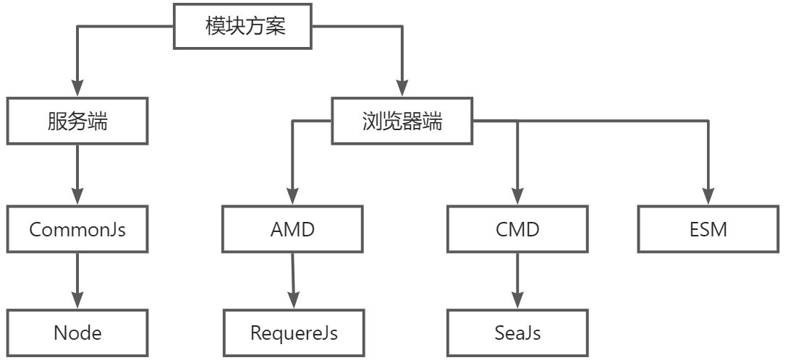

#### JS模块规范

> 对于模块化规范而言，一般包含以下两方面的内容：
> 1. 统一的模块化代码规范
> 2. 实现自动加载模块的加载器（也叫loader）



#### AMD 与 CMD 的主要区别：

1. 对于依赖的模块，AMD 是提前执行，CMD 是延迟执行。不过 RequireJS 从 2.0 开始，也改成可以延迟执行（根据写法不同，处理方式不同）。CMD 推崇 as lazy as possible.
2. CMD 推崇依赖就近，AMD 推崇依赖前置。
> 通俗来说：<br />AMD在加载完成定义（define）好的模块就会立即执行，所有执行完成后，遇到require才会执行主逻辑。（提前加载）<br />CMD在加载完成定义（define）好的模块，仅仅是下载不执行，在遇到require才会执行对应的模块。（按需加载）<br />AMD用户体验好，因为没有延迟，CMD性能好，因为只有用户需要的时候才执行。
> CMD为什么会出现，因为对node.js的书写者友好，因为符合写法习惯


#### AMD
> #### Asynchronous Module Definition，异步模块加载机制，主要用在浏览器上，对应的就是RequireJs,是 RequireJS 在推广过程中对模块定义的规范化产出，异步加载

**主要解决两个问题**

1. 多个js文件可能有依赖关系，被依赖的文件需要早于依赖它的文件加载到浏览器
2. js加载的时候浏览会停止页面渲染，加载文件越多，页面失去响应时间越长
```javascript
// 使用require.js来实现AMD规范的模块化：用require.config()指定引用路径。用define()来定义模块用require来加载模块。
// model1.js
define(function() {
	console.log('model1 entry');
	return {
		getHello: function() { return 'model1'; }
	}
})
// model2.js
define(function () {
	console.log('model2 entry')
	return {
		getHello: function() { return 'model2' }
	}
})
// main.js
define(function(require) {
	let model1 = require('./model1.js')
	console.log(model1.getHello())
	let model2 = require('./model2.js')
	console.log(model2.getHello())
})
// index.html
<script src="https://cdn.bootcss.com/require.js/2.3.6/require.min.js"></script>
<script>
	requirejs(['main'])	
  /*
	* 输出结果
		model1 entry
		model2 entry
		model1
		model2
	*/
</script>
```

在这里，我们使用define来定义模块，return来输出接口， require来加载模块，这是AMD官方推荐用法。

#### CMD
> #### Common Module Definition, 通用模块定义，对应SeaJS,和requijs解决一样问题，异步加载

- CMD 是 SeaJS 在推广过程中对模块定义的规范产出

**使用：**<br />_使用define来定义define(id?, deps?, factory)<br />factory是一个函数，有三个参数，function(require, exports, module)<br />require 是一个方法，接受 模块标识 作为唯一参数，用来获取其他模块提供的接口：require(id)<br />exports 是一个对象，用来向外提供模块接口<br />module 是一个对象，上面存储了与当前模块相关联的一些属性和方法_
```javascript
// model1.js
define(function (require, exports, module) {
  console.log('model1 entry');
  exports.getHello = function () {
      return 'model1';
  }
});
// model2.js
define(function (require, exports, module) {
  console.log('model2 entry');
  exports.getHello = function () {
      return 'model2';
  }
});
// main.js
define(function(require, exports, module) {
  var model1 = require('./model1'); //在需要时申明
  console.log(model1.getHello());
  var model2 = require('./model2'); //在需要时申明
  console.log(model2.getHello());
});
// index.html
<script src="https://cdn.bootcss.com/seajs/3.0.3/sea.js"></script>
<script>
  seajs.use('./main.js')
</script>
// 输出 
// model1 entry
// model1
// model2 entry
```

#### CommonJS
> #### CommonJS是服务端模块的规范，属于同步加载

**特征：**

- **一个文件就是一个模块，拥有单独作用域**
- **普通方式定义的变量、函数、对象属于该模块内**
- **CommonJS模块输出的是一个值的拷贝**
- CommonJS模块是运行时加载
- CommonJS模块的require()是同步加载模块
```javascript
// CommonJs通过require来加载模块,通过module.exports或者exports来暴露模块中的内容。
// lib.js
function incCounter () {
  counter++
}
module.exports = { 
  incCounter: incCounter
}
// main.js
const mod = require('./lib')
console.log(mod.incCounter)
mod.incCounter()
```

#### ESM (ES6模块)
> #### ECMA Script Modules，静态模块加载，也叫ES6模块

**特征：**

1. 浏览器可以直接加载，也是使用<script>标签，但是需要加入`type="module"`属性.`<script type="module" src="./foo.js"></script>`
2. 不管有没有在模块头部加入`use strict;`都自动采用严格模式
3. 输出的是值的引用
4. 编译时输出接口
5. import命令是异步加载，有一个独立的模块依赖解析阶段

**导出**

- 命名导出
- 默认导出
```javascript
/* 命名导出 */
// 写法1
export const name = 'dxg'
export const add = (a, b) => a + b
// 写法2
const name = 'dxg'
const add = (a, b) => a + b
export {name, add}
// 通过 as 关键字对变量命名
export {name, add as getSum} // 在导入是即为 name 和 getSum
/*默认导出*/
export default {
  name: 'dxg',
  add: function (a, b) {
    return a + b;
  }
}
```

**导入**

```javascript
// a.js
const name = 'dxg'
const add = function (a, b) {
  return a + b;
}
export {name, add}
// 一般导入
import {name, add} from './a.js'
add(2,4) // 6
// 通过 as 关键字对导入变量重命名
import {name, add as getSum} from './a.js'
getSum(3,4)
// 使用 import * as <myModle> 可以把所有导入的变量作为属性值添加到myModle对象中，从而减少对当前作用域的影响
import * as myModel from './a.js'
myModel.add(1,2)
```

#### UMD
> #### Universal Module Definition - 通用模块标准，是由社区想出来的一种整合了CommonJS和AMD两个模块定义规范的方法

```javascript
(function(window, factory) {
  if(typeof exports === 'object') {
    module.exports = factory()
  } else if(typeof define === 'function' && define.amd) {
    define(factory)
  } else {
    window.eventUtil = factory()
  }
})(this, function() {
  // do something
})
```

