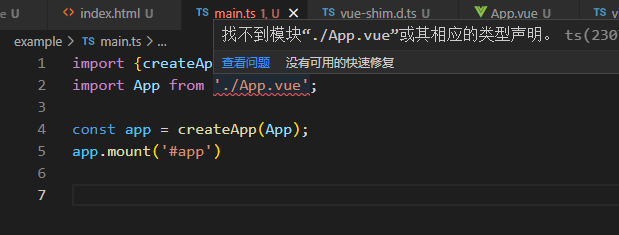
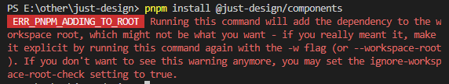
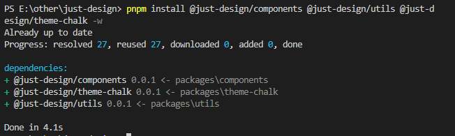
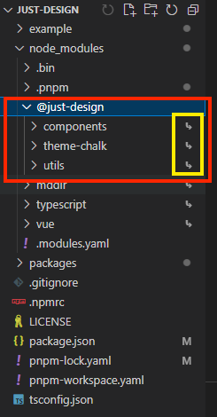
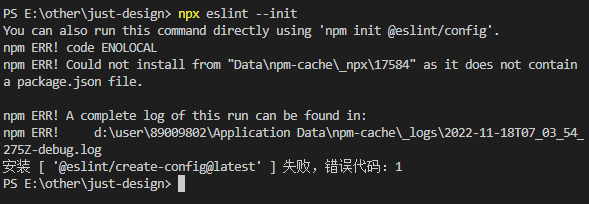
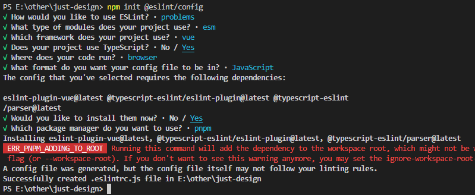
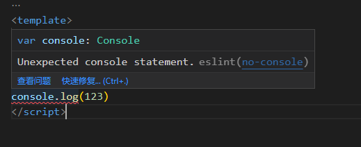
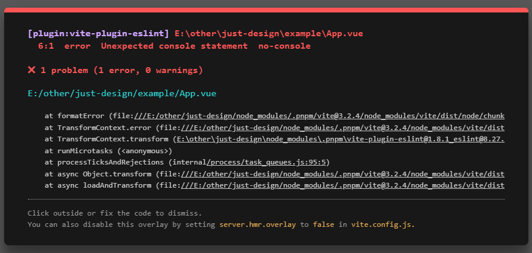
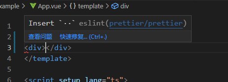

## 一、从0到1完成一套组件库工程化，了解其所涉及的全部知识。
### 1、代码管理 - monorepo

- 什么是monorepo
> `**monorepo**`是一种软件架构，简单来说，是一个仓库内包含多个开发项目（模块、包）。与之对应的另一种架构是`**multiRepo**`，一个仓库内只包含一个开发项目（模块、包）。

- multiRepo的痛点
> 每个项目都独立的，从**环境配置、代码复用、项目基建、公共工具类、依赖包等等**方面在每次新开项目的过程中需要统一管理，这样导致每个项目之间可能存在差异。比如，不同版本的公共类库使用，一处的变更会导致不同项目需要同时变更。假设**ci流程**、**配置发布流程**等等这些配置发生变化，多项目意味着每个项目都需要改变，显然这样的成本在后续维护中是比较高的。

- monorepo优缺点
1. 优点
> - 具有统一的工作流程，项目都在一个仓库，复用起来比较简单。比如，有一个登录模块，是使用npm包的形式引入的，此时，如果这个包进行了更新，传统项目中，我们需要所有项目都需要更新。而在`monorepo`项目中，只需要进行一次更新即可覆盖到所有项目。
> - 减少了项目之间不同环境配置差异而带来的难以理解奇怪场景的出现
> - 基建成本也会降低，所有项目都可以复用的统一配置，比如**代码质量检测、代码风格检测、cicd发布部署**

2. 缺点
> - 如果项目过大，提交代码、IDE性能上会有所影响

- monorepo落地

在实际使用过程中，同样对应了一套完整的工程化体系来支撑，因为基于`Monorepo`的项目管理，需要考虑诸多问题，比如项目键的**依赖分析、构建流程、测试流程、ci持续集成，多项目性能问题**等等一系列设计工程化的问题。社区提供了一些成熟的方案：比如 [lerna](https://lerna.js.org/)、**Pnpm workspace等等。**
### 2、技术栈选型 - vite 技术栈

- vite 技术栈优势
> 1. 效率高、编译快、运行速度极快。运行效率其实是因为Vite的原生特点，主要来自于`Bundless`机制 + `Esbuild`高效编译器两个原因。`webpack`漫长的编译时间主要来自于打包，而Vite则是基于浏览器对esm的原生支持特性，直接解决掉这个时间开销，同时对于代码的编译也采用了基于`Go`语言开发的`Esbuild`，其构建素的也得到了显著提升。
> 2. 原生支持`ESM`和`TypeScript`，以往项目需要使用，一般都需要`babel编译器`进行转换，而Vite则省去了这些步骤，可以直接进行开发。
> 3. 拥有非常好的生态和专业团队的支持。同时也对Vue/React都支持良好。在专业团队的维护下，可以放心使用
> 4. 最后我们需要考虑开发服务器、文档的建设、测试工具、语法编辑器、代码质量、代码风格等等场景，会选用很多不同的工作栈，而有了Vite后，我们可以相对统一的选用了，如下：

|  | element-plus | vite技术栈组件库 |
| --- | --- | --- |
| 开发服务器 | webpack-dev-server | Vite |
| 文档建设 | webpack + markdown | Vite-Press |
| 测试工具 | Jest | Vitest |
| 语法编辑器 | Babel | Vite（内置babel） |
| 代码规范 | Eslint | Eslint |
| 代码风格 | Prettier | Prettier |

### 3、依赖包管理工具 pnpm

- 相对于npm/yarn/cnpm的优势
> 1. 磁盘空间利用非常高效
> 2. 包安装速度极快
> 3. 可以支持 `monorepo` 架构，比 `lerna` 配置更简单

### 4、其他所需要了解的知识点
> - 代码质量检测，使用`Eslint`进行代码质量检测
> - 代码风格检测，使用`Prettier`统一代码风格
> - 统一commit提交校验，使用`husky`进行统一git提交校验
> - 进行友好的文档开发，使用`VitePress`进行文档开发
> - 打包多种js规范的输出包
> - 实现组件库的按需引入
> - 持续基础CI，基于Github Action 回归验证
> - 开源许可，维护自己版本，制作自己专属徽章（？??）
> - 使用`Vercel`部署线上文档
> - 编写标准的`Readme`
> - 创建`Cli`工具提高研发效率
> - .......

## 二、开发环境准备
### 1、开发工具
> 1. node.js 14+
> 2. pnpm 7.15.57+
> 3. 编辑器 vscode

### 2、基础Monorepo环境建设

- 包名选择与注册
> - 使用命令`npm view package-name version`查看，如果返回版本号，说明已经被注册了，如果返回404则没有被注册。
> - 有一种特殊情况，需要的报名被注册了，也可以添加命名空间来解决，例如 antd 被占用了，可以添加一个命名空间这样 @yourname/antd 进行使用。


- 项目目录架构
1. 首先创建文件夹`_just-design_`_，_运行`pnpm init`即可得到一个package.json：
```javascript
{
  "name": "just-design",
  "version": "1.0.0",
  "description": "",
  "main": "index.js",
  "scripts": {
    "test": "echo \"Error: no test specified\" && exit 1"
  },
  "keywords": [],
  "author": "",
  "license": "ISC"
}
```
但是作为根目录，这个项目不需要发布，所以将它调整为私有，不需要版本，不需要关键字，入口文件等等，改为如下基础配置即可：
```javascript
{
  "name": "just-design",
  "private": true,
  "version": "0.0.1",
  "description": "monorepo vue design",
  "scripts": {
    "test": "echo \"Error: no test specified\" && exit 1"
  },
  "author": "18028578009@163.com",
  "license": "MIT"
}
```
同时需要对pnpm进行一些简单配置，在根目录下创建一个配置`.npmrc`文件，在配置中添加一个`shamefully-history = true `
> 说明：默认情况下，pnpm创建一个半严格的`node_modules`，意味着依赖项可以访问未声明的依赖项，但是`node_modules`之外的模块不行。通过这种布局，生态系统中大多数包都可以正常工作。但是如果某些工具仅在提升的依赖项位于根目录的`node_modules`时才有效，可以将`shamefully-history`设置为`true`来提升他们。

2. 下载依赖包 vue3 和 typescript：`pnpm install vue@next typescript -D`
3. 下载完依赖，在根目录下执行：`npx tsc --init`，生成ts基础配置文件。参考`element-plus`项目的配置进行调整为如下这样：
```json
{
  "compilerOptions": {
    "module": "ESNext",
    "declaration": false,
    "noImplicitAny": false,
    "removeComments": true,
    "moduleResolution": "node",
    "esModuleInterop": true,
    "target": "es6",
    "sourceMap": true,
    "lib": [
      "ESNext",
      "DOM"
    ],
    "allowSyntheticDefaultImports": true,
    "experimentalDecorators": true,
    "forceConsistentCasingInFileNames": true,
    "resolveJsonModule": true,
    "strict": true,
    "skipLibCheck": true,
  },
  "exclude": [
    "node_modules",
    "**/__tests__",
    "dist/**"
  ]
}
```

4. 接着开始使用`pnpm`创建子项目。
> 在`pnpm`中创建`monorepo`结构需要依赖一个配置文件`pnpm-workspace.yaml`，在根目录下创建它，具体配置可以参考[这里](https://pnpm.io/zh/pnpm-workspace_yaml)

5. 考虑需要哪些子项目
> 1. 正常来说必须包含`**组件库项目**`**、**`**开发时预览项目（用于调试）**`**、**`**开发文档项目（用于最终上线文档）**`**、**`**公共方法项目（用于抽离公共逻辑）**`等等
> 2. 参考`element-plus`可以发现，他抽离了更多的项目，在根目录的`package.json`文件中以`@Element-plus/`开头都是一个单独的项目
> 3. 我们先创建2个项目，一个**example用于调试预览（相当于Element-plus的paly）**，另一个就是相对核心的`packages`，基本上大部分开源项目的组件库代码都放在其中，然后我们又可以在`packages`下面去创建更多的项目，比如`components--放置组件`、`theme-chalk--放置样式文件`、`contants--放置场景`、`utils--放置公共方法文件`。

6. 定义 pnpm-workspace.yaml 文件
```code   
packages:
  'packages/**'
  'example
```

1. 对子项目进行初始化，目录结构如下：

'|-- just-design',<br />  '    |-- .gitignore',<br />  '    |-- .npmrc',<br />  '    |-- LICENSE',<br />  '    |-- package.json',<br />  '    |-- pnpm-lock.yaml',<br />  '    |-- pnpm-workspace.yaml',<br />  '    |-- tsconfig.json',<br />  '    |-- example',  // 关键目录<br />  '    |-- packages',  // 关键目录<br />  '        |-- components',<br />  '        |-- theme-chalk',<br />  '        |-- utils',


1. 添加完文件夹后，一次进入 packages/components、packages/theme-chalk、packages/utils里面执行`pnpm init`进行初始化。以utils为例，生成的package.json文件需要做些调整：**前面多加一层命名空间，**表示当前的utils是我们@just-design的子项目。
```json
{
  "name": "@just-design/utils",
  "version": "0.0.1",
  "description": "",
  "main": "index.js",
  "scripts": {
    "test": "echo \"Error: no test specified\" && exit 1"
  },
  "keywords": [],
  "author": "",
  "license": "ISC"
}
```

### 3、本地开发调试预览项目开发

1. 进入`example`项目中运行`pnpm init`初始化，同理并修改`name`属性，为其添加命名空间，如下：
  
```json
{
  "name": "@just-design/example",
  "version": "1.0.0",
  "description": "",
  "main": "index.js",
  "scripts": {
    "test": "echo \"Error: no test specified\" && exit 1"
  },
  "keywords": [],
  "author": "",
  "license": "ISC"
}
```

1. 安装依赖

`pnpm install vite @vitejs/plugin-vue -D `

3. 在根目录下创建`vite.config.ts`
```javascript
import { defineConfig } from 'vite';
import vue from '@vitejs/plugin-vue';
export default defineConfig({
  plugins: [vue()]
})
```

4. 在package.json中添加启动命令
```json
"scripts": {
  "dev": "vite"
},
```

5. 依次在根目录下创建`index.html`、`main.ts`、`App.vue`文件
- index.html
```json
<!DOCTYPE html>
<html lang="en">
<head>
  <meta charset="UTF-8">
  <meta http-equiv="X-UA-Compatible" content="IE=edge">
  <meta name="viewport" content="width=device-width, initial-scale=1.0">
  <title>exmaple</title>
</head>
<body>
  <div id="app"></div>
  <script src="./main.ts" type="module"></script>
</body>
</html>
```

- main.ts
```javascript
import {createApp} from 'vue';
import App from './App.vue';
const app = createApp(App);
app.mount('#app')
```

- App.vue
```javascript
<template>
  <h2>开发调试页面</h2>
</template>
```

6. 添加vue类型声明文件
- 由于是TypeScript项目，所以会出现这个错误，提示是没有相应的类型说明



- 因此我们需要在根目录下创建一个`typings`目录，并且在目录下加入vue类型声明文件`vue-shim.d.ts`，这个文件名称不重要，只需要是`d.ts`结尾的文件即可。
```javascript
declare module '*.vue' {
  import type { DefineComponent } from 'vue'
  const component: DefineComponent<{}, {}, any>
  export default component
}
```

- 此时，报错已消失，运行命令`pnpm run dev`启动vite可以看到成功打开页面


- 然而当前执行命令是在just-design/example目录下，并不是根目录。所以需要把命令放在根目录中，因此需要在根目录的package.json中添加一条命令`"dev": "pnpm -C example dev"`。此时在根目录执行`pnpm run dev`即可实现相同效果。**需要知道的是**`**-C**`**后面的参数表示命名空间，表示在example命名空间下执行dev命令：**
```json
// ...
"scripts": {
    "dev": "pnpm -C example dev"
  },
// ...
```
### 4、子项目之间的相互引用
由于`packages`下的三个子项目进行了`pnpm init`，因此可以看做是单独的项目，所以开发过程中是可以安装到根目录当中去，实现子项目之间的相互引用了。在根目录下安装：

`
 E:\other\just-design> pnpm install @just-design/components
`

<br />
此时发现报错了，并没有安装成功。翻译为：如果想安装包到根目录下，在安装的时候就必须在参数后面添加`-w`表示同意安装到根目录，所以我们添加上`-w`进行安装，如下图所示，表示已经安装成功了。

`
pnpm install @just-design/components @just-design/utils @just-design/theme-chalk -w
`



> 这里的下载的其实就是本地的包，实际就是创建了一个软链接，这个和`npm link`是同理的，但不同的是`npm link`是将别处写的模块引入到项目中来，而当前是将自己的模块创建一个软链接安装在根目录下，更加方便。此时在更目录的`node_modules`可以看到，后面有小箭头，这个表示本地创建的软链接。
> 下载完成后，会成功创建软链接，所以这些包可以在开发过程中完成互相引用了，此时我们感受到了`**Monorepo**`架构的便利性。


## 三、制定项目规范和代码风格，完善统一代码质量、风格、检测

- 参考文献
> 1. [配置原理](https://juejin.cn/post/7163214891740823588)
> 2. [Eslint使用入门指南](https://juejin.cn/post/7067072359995457567)
> 3. [Eslint进阶使用指南](https://juejin.cn/post/7067722555783643144)

### 1、统一代码质量 Eslint

- **前言：什么是代码质量校验**
> 1. 定义了不使用的变量
> 2. 引入了不使用的组件
> 3. 使用了不严格的`**var**`等等

- **集成Eslint**
1. 安装依赖包（根目录下）。这种校验只需要在开发环境使用，所以下载在开发环境即可。同时是`Monorepo`项目，所以需要在后面加上`-w`，如果是普通项目就不需要加。
`
pnpm i eslint -D -w
`

2. 运行命令生成配置信息。**Eslint**将根据配置信息对项目进行校验，这个配置信息的文件格式有很多种，以比如**config.js/ts，rc，yaml**结尾后者直接写入**package.json**当中，所以有时候配置没生效的时候，可能是别的地方也配置了，导致被覆盖。

`
npx eslint --init
`

运行命令发现报错，按照提示，先安装@eslint/create-config@latest，再执行`npm init @eslint/config`<br />
<br />


- 一般情况下选择完会自动下载相关依赖，但是由于是`Monorepo`架构，根据报错信息提示需要添加`-w`进行安装，因此需要手动安装。
- 一共下载了三个依赖包，他们的作用如下：
> 1. eslint-plugin-vue
> - eslint默认只支持检测js文件，所以如果Vue项目需要支持的话就需要这个插件，让其支持检测`.vue`的文件。同理如果是别的类型的也需要下载别的插件，比如`jsx`。
> 2. typescript-eslint/eslint-plugin
> - Typescript项目，所以需要支持ts类型文件就得下载这个插件
> 3. typescript-eslint/parser
> - parser解析器，是用来解析ts语法的。

1. 配置文件的优先级：
`
.eslintrc.js > .eslintrc.yaml > .eslintrc.yml > .eslintrc.json > .eslintrc > package.json
`

1. 添加rules
```json
module.exports = {
    "env": {
        "browser": true,
        "es2021": true
    },
    "extends": [
        "eslint:recommended",
        "plugin:vue/vue3-essential",
        "plugin:@typescript-eslint/recommended"
    ],
    "overrides": [
    ],
    "parser": "vue-eslint-parser",
    "parserOptions": {
        "ecmaVersion": "latest",
        "parser": "@typescript-eslint/parser",
        "sourceType": "module"
    },
    "plugins": [
        "vue",
        "@typescript-eslint"
    ],
    "rules": {
        "no-console": "error", // 关键代码
        "no-unused-vars": "error"
    }
}
```
添加rules后，在代码中添加console.log就会报错：<br />


1. 结合开发环境提示
> 1. 经过以上配置，不一定会出现错误提示。因为这个提示来自编辑器，因此，如果想要编辑器个提示这个，首先需要安装 vscode 的`eslint插件`，安装了才能实现提示，否则就不会有红线。同时，配置规则有三种等级`0,1,2`对应着`off、warn、error`，表示的这是关闭、警告、错误三个等级，关闭等于不提示，警告是黄线，错误时红线。
> 2. 在 vscode 中，配置信息是有缓存的，如果修改了配置不生效，可以使用`contol+shift+p`调出面板，再输入`reload`对窗口就行重载，这样可以让其重新检测一次配置信息。
> 3. 如果用户没安装插件，我们还可以在页面上为开发者这样显示错误，这样即使没有插件，也能让用户看到错误。



> 4. 实现步骤：
> - 安装插件：`pnpm i vite-plugin-eslint -D`
> - 然后再vite.config.ts中引入这个插件，使用即可。该插件也有其他配置参数，但是默认就会检测**.js、.jsx、.ts、.tsx、.vue、.svelte**这些文件，因此可以省略掉。

```javascript
import { defineConfig } from 'vite';
import vue from '@vitejs/plugin-vue';
import viteEslint from 'vite-plugin-eslint';

export default defineConfig({
  plugins: [vue(), viteEslint()]
})
```

1. 添加校验命令
- 在package.json中添加两个脚本用于检测和修复
```json
"scripts": {
    // ...
    "lint:fix": "eslint . --fix",
    "lint:eslint": "eslint ."
  },
```
并不是所有的文件都需要检测，比如打包之后的文件，引入的三方库等等，我们可以在根目录创建`.eslintignore`文件，在里面声明的文件就可以不进行检测了。<br />至此，项目就可以使用`eslint`进行检测了。
### 2、统一代码风格 Prettier

- 前言
> - 代码质量检测更多的是语法方面的检测，如果想要风格实现统一，比如，一行多少个字，要不要分号，要不要双引号等等这些关于代码风格的统一需要用到`prettier`，其是专注于代码风格的工具。
> - `eslint`本身也有少量的代码风格规则，但是在更多的场景下是不支持的，因此推荐使用`prettier`统一代码风格。

- 使用
1. 下载依赖
`
pnpm i prettier -D -w
`

2. 配置
> - 需要在根目录下创建一个配置文件和一个忽略文件，分别是`prettier.config.js`和`.prettierignore`文件，配置可以参考官网[Option Prettier](https://prettier.io/docs/en/options.html#single-attribute-per-line)。
> - 可配置的文件也有很多种，具体可以参考[Configuration File · Prettier](https://prettier.io/docs/en/configuration.html)
> - 和`eslint`一样，在使用的时候需要下载`prettier-eslint`插件配合使用。

- 常用配置
```javascript
module.exports = {
  printWidth: 120, //最大单行长度
  tabWidth: 2, //每个缩进的空格数
  useTabs: false, //使用制表符而不是空格缩进行
  semi: true, //在语句的末尾打印分号
  vueIndentScriptAndStyle: true, //是否缩进 Vue 文件中的代码<script>和<style>标签。
  singleQuote: true, //使用单引号而不是双引号
  quoteProps: 'as-needed', //引用对象中的属性时更改 "as-needed" "consistent" "preserve"
  bracketSpacing: true, //在对象文字中的括号之间打印空格
  trailingComma: 'none', //在对象或数组最后一个元素后面是否加逗号（在ES5中加尾逗号）
  arrowParens: 'avoid', //箭头函数只有一个参数的时候是否使用括号 always：使用  avoid： 省略
  insertPragma: false, //是否在文件头部插入一个 @format标记表示文件已经被格式化了
  htmlWhitespaceSensitivity: 'strict', //HTML 空白敏感性 css strict ignore
  endOfLine: 'auto', //换行符使用什么
  tslintIntegration: false //不让ts使用prettier校验
};
```

- 由于`eslint`有自己的规则，还会造成格式化之后`eslint`就会报错，会出现以下三个问题
> 1. 每次需要手动格式化
> 2. 没有语法提示
> 3. `prettier`的配置和`eslint`有冲突。

- 解决冲突
1. 需要用到两个新的包
- `eslint-config-prettier`: 会关闭掉所有的`eslint`关于格式化的配置
- `eslint-plugin-prettier`: 会将`prettier`配置为`eslint`的插件，让其成为`eslint`的一个规则，这样不满足`prettier`规则的地方就会报错提示。

2. 下载依赖包：
`
pnpm i eslint-plugin-prettier eslint-config-prettier -D
`
下载完后，将这个配置规则和插件添加到`.eslintrc.js`中，需要启动这个规则，只需要在`rules`里面添加一个配置项`prettier/prettier: 2`，此时就出现代码风格提示了，如果没生效，记得重载窗口。如下：
```javascript
module.exports = {
	"env": {
		"browser": true,
		"es2021": true
	},
	"extends": [
    'plugin:vue/vue3-essential', 
    'prettier',  // 关键代码
    'plugin:@typescript-eslint/recommended'
  ],
	"overrides": [
	],
	"parser": "vue-eslint-parser",
	"parserOptions": {
		"ecmaVersion": "latest",
		"parser": "@typescript-eslint/parser",
		"sourceType": "module"
	},
	"plugins": [
    'vue',
    '@typescript-eslint',
    'prettier' // 关键代码
  ],
	"rules": {
		'prettier/prettier': 2, // 关键代码
		"no-console": "error",
		"no-unused-vars": "error",
		"no-extra-semi": 2,
		"quotes": [1, "single"],
		"semi": [2, "always"]
	}
}
```



- 除了手动修改`.eslintrc.js`外，还可以使用插件携带的配置：在extends下面继承`plugin:prettier/recommended`，它分别在配置项和插件项引入了两个包，rules中开启了`prettier规则`，并关闭两条规则，它的源码如下：
```javascript
{
  "extends": ["prettier"], // 使用eslinst-config-prettier中的配置项
  "plugins": ["prettier"], // 注册该prettier插件
  "rules": {
    "prettier/prettier": "error", // 在eslint中运行prettier，并启用该插件提供的规则
    "arrow-body-style": "off", // 关闭规则
    "prefer-arrow-callback": "off" // 关闭规则
  }
}
```

1. 自动修复
> - 此时，已经可以将两者配合起来使用了。我们可以结合编辑器，在保存的时候自动修复所有可以修复的错误。
> - 对于编辑器而言，在本地单独设置只能给自己使用，别人去开发的时候无法实现这一步，所以，我们可以将这些配置也放到项目中，对于`vscode`的配置，我们只需要在根目录添加一个`.vscode`目录，并在其中创建一个`settings.json`文件，就可以更改编辑器配置了，同时编辑器也会以这里的权限为最高。可以在这个配置文件配置保存的时候，自动修复`eslint`的错误即可，添加如下：

```json
{
  "eslint.validate": ["html", "vue", "javascript", "jsx"],
  "emmet.syntaxProfiles": {
    "vue-html": "html",
    "vue": "html"
  },
  "editor.tabSize": 2,
  "eslint.alwaysShowStatus": true,
  "eslint.quiet": true,
  "editor.codeActionsOnSave": {
    "source.fixAll.eslint": true,  // 关键代码，设置为true,保存时就可以自动修复
    "source.fixAll": true
  }
}
```

- 针对组件库的改动
> - 上述的配置可以使用任何项目，但针对`monorepo`架构，需要去创建一个子项目，将所有的配置全部写入子项目当中，同时将其作为一个子模块。这样不仅仅当前项目，在以后别的项目也同样可以使用，可以对其单独发包。最终使用的时候，直接继承就可以使用了，如下：

```json
{
  "root": true,
  "extends": ["@just-design/eslint-config"]
}
```

同时需要注意的是，`eslint`默认只支持js格式的文件，项目中，我们分别下载了vue和TS的额外编译器，同样带来了两种格式的规则，因此可以在三个不同的地方查看规则：
> 1. js: [Rules - ESLint - Pluggable JavaScript Linter](https://eslint.org/docs/latest/rules/)
> 2. ts:[typescript-eslint.io/rules/](https://typescript-eslint.io/rules/)
> 3. vue: [Available rules | eslint-plugin-vue](https://typescript-eslint.io/rules/)

所以日常看到的很多规则来自不同的包，在eslint官网并不能全部找到。

- 改造步骤
1. 目录结构

|-- eslint-config<br />     |-- eslint.rules.js<br />     |-- index.js<br />     |-- package.json<br />     |-- ts.rules.js<br />     |-- vue.rules.js

```json
{
  "name": "@just-design/eslint-config",
  "version": "0.0.1",
  "description": "",
  "main": "index.js",
  "scripts": {
    "test": "echo \"Error: no test specified\" && exit 1"
  },
  "keywords": [],
  "author": "",
  "license": "ISC"
}
```

```javascript
const eslintRules = require('./eslint.rules');
const tsRules = require('./ts.rules');
const vueRules = require('./vue.rules');
module.exports = {
  env: {
    browser: true,
    es2021: true,
    node: true
  },
  /* 'plugin:prettier/recommended' 可手动配置 */
  extends: ['plugin:vue/vue3-essential', 'prettier', 'plugin:@typescript-eslint/recommended'],
  overrides: [],
  parser: 'vue-eslint-parser',
  parserOptions: {
    ecmaVersion: 'latest',
    sourceType: 'module',
    parser: '@typescript-eslint/parser'
  },
  plugins: ['vue', '@typescript-eslint', 'prettier'],
  rules: {
    ...eslintRules,
    ...tsRules,
    ...vueRules
  }
};
```

```javascript
// eslint配置规则 https://eslint.org/docs/latest/rules/
module.exports = {
  'prettier/prettier': 'error',
  'arrow-body-style': 'off',
  'prefer-arrow-callback': 'off',
  'no-console': 2,
  // 不允许不必要的转义字符 https://eslint.org/docs/latest/rules/no-useless-escape
  'no-useless-escape': 'off',
  //
  'comma-dangle': 'off',
  // 禁止使用 var https://eslint.org/docs/latest/rules/no-var#rule-details
  'no-var': 'error',
  // 使用单引号 https://eslint.org/docs/latest/rules/quotes#version
  quotes: ['error', 'single'],
  // 禁止分号 https://eslint.org/docs/latest/rules/semi#rule-details
  // semi: 'error',
  // 禁止 debugger https://eslint.org/docs/latest/rules/no-debugger#rule-details
  'no-debugger': 'error',
  // 禁止未使用的变量 https://eslint.org/docs/latest/rules/no-unused-vars#rule-details
  'no-unused-vars': 'error',
  // 不允许使用未声明的变量 https://eslint.org/docs/latest/rules/no-undef
  'no-undef': 'off',
  // 函数括号前的空格 https://eslint.org/docs/latest/rules/space-before-function-paren
  'space-before-function-paren': 'off',
  // 禁止多个空行 https://eslint.org/docs/latest/rules/no-multiple-empty-lines#rule-details
  'no-multiple-empty-lines': ['error', { max: 1, maxEOF: 0, maxBOF: 0 }],
  // 在文件末尾要求或禁止换行 https://eslint.org/docs/latest/rules/eol-last#rule-details
  'eol-last': 'error',
  // 禁止所有选项卡 https://eslint.org/docs/latest/rules/no-tabs#rule-details
  'no-tabs': 'error',
  'default-param-last': 'off'
};
```

```javascript
/* ts配置规则  https://typescript-eslint.io/rules */
module.exports = {
  // 规定数组类型定义方式 https://typescript-eslint.io/rules/array-type
  '@typescript-eslint/array-type': 'error',
  // 禁止使用大写 String、Number 定义类型 https://typescript-eslint.io/rules/ban-types
  '@typescript-eslint/ban-types': 'off', // beta
  // 不允许尾随逗号 https://typescript-eslint.io/rules/comma-dangle
  '@typescript-eslint/comma-dangle': 'error',
  // 强制使用 interface 定义类型 https://typescript-eslint.io/rules/consistent-type-definitions
  '@typescript-eslint/consistent-type-definitions': ['error', 'interface'],
  // 统一导出规则 https://typescript-eslint.io/rules/consistent-type-exports
  // '@typescript-eslint/consistent-type-exports': 'error',
  // 自定义对象类型样式 https://typescript-eslint.io/rules/consistent-indexed-object-style
  '@typescript-eslint/consistent-indexed-object-style': ['warn', 'record'],
  // !禁止使用后缀运算符的非空断言 https://typescript-eslint.io/rules/no-non-null-assertion/
  '@typescript-eslint/no-non-null-assertion': 'error',
  // 强制一致地使用类型导入 https://typescript-eslint.io/rules/consistent-type-imports
  '@typescript-eslint/consistent-type-imports': ['error', { prefer: 'type-imports' }],
  // 禁止未使用的变量 https://typescript-eslint.io/rules/no-unused-vars
  '@typescript-eslint/no-unused-vars': 'error',
  // 不可以有 any https://typescript-eslint.io/rules/no-explicit-any/
  '@typescript-eslint/no-explicit-any': 'off',
  // 不可以有 require https://typescript-eslint.io/rules/no-var-requires/
  '@typescript-eslint/no-var-requires': 'off',
  // 带有默认值的函数参数在最后 https://typescript-eslint.io/rules/default-param-last
  '@typescript-eslint/default-param-last': 'error',
  // 必须标记函数返回值 https://typescript-eslint.io/rules/explicit-function-return-type
  '@typescript-eslint/explicit-function-return-type': 'off'
};
```

```javascript
/* vue配置规则 https://eslint.vuejs.org/rules/ */
module.exports = {
  /* 禁止在模板中使用 this https://eslint.vuejs.org/rules/this-in-template.html */
  'vue/this-in-template': 'error',
  /* 关闭名称校验 https://eslint.vuejs.org/rules/multi-word-component-names.html */
  'vue/multi-word-component-names': 'off',
  'vue/max-attributes-per-line': ['error', { singleline: { max: 30 }, multiline: { max: 30 } }],
  /*  组件标签顺序 https://eslint.vuejs.org/rules/component-tags-order.html */
  'vue/component-tags-order': ['error', { order: ['template', 'script', 'style'] }],
  /* 只允许使用ts类型的script https://eslint.vuejs.org/rules/block-lang.html */
  'vue/block-lang': ['error', { script: { lang: 'ts' } }],
  /* 只允许使用 setup script类型的语法 https://eslint.vuejs.org/rules/component-api-style.html */
  'vue/component-api-style': ['error', ['script-setup', 'composition']],
  /* 自定义事件强制使用中划线连接 https://eslint.vuejs.org/rules/custom-event-name-casing.html */
  'vue/custom-event-name-casing': ['error', 'kebab-case', { ignores: [] }],
  /* 禁止使用 v-html  https://eslint.vuejs.org/rules/no-v-html.html */
  'vue/no-v-html': 'error',
  /* bind绑定时能简写就直接简写 https://eslint.vuejs.org/rules/prefer-true-attribute-shorthand.html */
  'vue/prefer-true-attribute-shorthand': 'error',
  /* 模板中未使用的组建不允许注册 https://eslint.vuejs.org/rules/no-unused-components.html */
  'vue/no-unused-components': 'error',
  /* 单标签禁止改写成双标签 https://eslint.vuejs.org/rules/html-self-closing.html */
  'vue/html-self-closing': 'off',
  /* 强制标签闭合 https://eslint.vuejs.org/rules/html-end-tags.html */
  'vue/html-end-tags': 'error',
  /* 模板缩进规则 */
  'vue/html-indent': ['error', 2, { attribute: 1, baseIndent: 1, closeBracket: 0, alignAttributesVertically: true }],
  /* 模板中使用组建必须使用中划线小写形式 https://eslint.vuejs.org/rules/component-name-in-template-casing.html */
  'vue/component-name-in-template-casing': ['error', 'kebab-case', { registeredComponentsOnly: false }],
  // 对模板中的自定义组件强制执行属性命名样式 https://eslint.vuejs.org/rules/attribute-hyphenation.html#vue-attribute-hyphenation
  'vue/attribute-hyphenation': 'error',
  // Prop 名称强制使用特定大小写 https://eslint.vuejs.org/rules/prop-name-casing.html
  'vue/prop-name-casing': 'error',
  // 强制执行 v-on 事件命名样式 https://eslint.vuejs.org/rules/v-on-event-hyphenation.html
  'vue/v-on-event-hyphenation': 'error',
  // 不允许字段名称重复 https://eslint.vuejs.org/rules/no-dupe-keys.html
  'vue/no-dupe-keys': 'error',
  // 禁止 v-if / v-else-if 链中的重复条件
  'vue/no-dupe-v-else-if': 'error',
  // 不允许重复属性 https://eslint.vuejs.org/rules/no-duplicate-attributes.html
  'vue/no-duplicate-attributes': [
    'error',
    {
      allowCoexistClass: true,
      allowCoexistStyle: true
    }
  ],
  // 不允许 export 进入 <script setup> https://eslint.vuejs.org/rules/no-export-in-script-setup.html
  'vue/no-export-in-script-setup': 'error',
  // 不允许修改 props https://eslint.vuejs.org/rules/no-mutating-props.html
  'vue/no-mutating-props': 'error',
  // 不允许解析错误的 template https://eslint.vuejs.org/rules/no-parsing-error.html
  'vue/no-parsing-error': [
    'error',
    {
      'abrupt-closing-of-empty-comment': true,
      'absence-of-digits-in-numeric-character-reference': true,
      'cdata-in-html-content': true,
      'character-reference-outside-unicode-range': true,
      'control-character-in-input-stream': true,
      'control-character-reference': true,
      'eof-before-tag-name': true,
      'eof-in-cdata': true,
      'eof-in-comment': true,
      'eof-in-tag': true,
      'incorrectly-closed-comment': true,
      'incorrectly-opened-comment': true,
      'invalid-first-character-of-tag-name': true,
      'missing-attribute-value': true,
      'missing-end-tag-name': true,
      'missing-semicolon-after-character-reference': true,
      'missing-whitespace-between-attributes': true,
      'nested-comment': true,
      'noncharacter-character-reference': true,
      'noncharacter-in-input-stream': true,
      'null-character-reference': true,
      'surrogate-character-reference': true,
      'surrogate-in-input-stream': true,
      'unexpected-character-in-attribute-name': true,
      'unexpected-character-in-unquoted-attribute-value': true,
      'unexpected-equals-sign-before-attribute-name': true,
      'unexpected-null-character': true,
      'unexpected-question-mark-instead-of-tag-name': true,
      'unexpected-solidus-in-tag': true,
      'unknown-named-character-reference': true,
      'end-tag-with-attributes': true,
      'duplicate-attribute': true,
      'end-tag-with-trailing-solidus': true,
      'non-void-html-element-start-tag-with-trailing-solidus': false,
      'x-invalid-end-tag': true,
      'x-invalid-namespace': true
    }
  ],
  // 禁止使用 ref() 包装的值作为操作数 https://eslint.vuejs.org/rules/no-ref-as-operand.html
  'vue/no-ref-as-operand': 'error',
  // 不允许在组件定义中使用保留名称 https://eslint.vuejs.org/rules/no-ref-as-operand.html
  'vue/no-reserved-component-names': 'error',
  // 不允许覆盖保留键 https://eslint.vuejs.org/rules/no-reserved-keys.html
  'vue/no-reserved-keys': 'error',
  // 禁止 props 中的保留名称 https://eslint.vuejs.org/rules/no-reserved-props.html
  'vue/no-reserved-props': [
    'error',
    {
      vueVersion: 3
    }
  ],
  // 不允许计算属性中的副作用 https://eslint.vuejs.org/rules/no-side-effects-in-computed-properties.html
  'vue/no-side-effects-in-computed-properties': 'error',
  // 禁用key属性<template> https://eslint.vuejs.org/rules/no-template-key.html
  'vue/no-template-key': 'error',
  // 不允许在 textarea 中写 {{}} https://eslint.vuejs.org/rules/no-textarea-mustache.html
  'vue/no-textarea-mustache': 'error',
  // 禁止 v-for 指令或范围属性的未使用变量定义 https://eslint.vuejs.org/rules/no-unused-vars.html
  'vue/no-unused-vars': 'error',
  // 不允许调用计算属性 https://eslint.vuejs.org/rules/no-use-computed-property-like-method.html
  'vue/no-use-computed-property-like-method': 'error',
  // 禁止在与 v-for 相同的元素上使用 v-if https://eslint.vuejs.org/rules/no-use-v-if-with-v-for.html
  'vue/no-use-v-if-with-v-for': [
    'error',
    {
      allowUsingIterationVar: true
    }
  ],
  // 禁止无用的属性<template> https://eslint.vuejs.org/rules/no-useless-template-attributes.html
  'vue/no-useless-template-attributes': 'error',
  // 禁止组件上的 v-text / v-html https://eslint.vuejs.org/rules/no-v-text-v-html-on-component.html
  'vue/no-v-text-v-html-on-component': 'error',
  // 要求 prop 类型是构造函数 https://eslint.vuejs.org/rules/require-prop-type-constructor.html
  'vue/require-prop-type-constructor': 'error',
  // 强制渲染函数始终返回值 https://eslint.vuejs.org/rules/require-render-return.html
  'vue/require-render-return': 'error',
  // V-bind:key使用v-for指令要求 https://eslint.vuejs.org/rules/require-v-for-key.html
  'vue/require-v-for-key': 'error',
  // 强制 props 默认值有效 https://eslint.vuejs.org/rules/require-valid-default-prop.html
  'vue/require-valid-default-prop': 'off',
  // 强制返回语句存在于计算属性中 https://eslint.vuejs.org/rules/return-in-computed-property.html
  'vue/return-in-computed-property': 'error',
  // 需要有效的属性名称 https://eslint.vuejs.org/rules/valid-attribute-name.html
  'vue/valid-attribute-name': 'off',
  // 强制执行有效的模板根 https://eslint.vuejs.org/rules/valid-template-root.html
  'vue/valid-template-root': 'off',
  // 执行有效v-bind指令 https://eslint.vuejs.org/rules/valid-v-bind.html
  'vue/valid-v-bind': 'error',
  // 禁止在数据上使用不推荐使用的对象声明 https://eslint.vuejs.org/rules/no-deprecated-data-object-declaration.htm
  'vue/no-deprecated-data-object-declaration': 'error',
  // 禁止使用已弃用 destroyed 和 beforeDestroy 生命周期挂钩 https://eslint.vuejs.org/rules/no-deprecated-destroyed-lifecycle.html
  'vue/no-deprecated-destroyed-lifecycle': 'error',
  // 禁止使用已弃用 $listeners https://eslint.vuejs.org/rules/no-deprecated-dollar-listeners-api.html
  'vue/no-deprecated-dollar-listeners-api': 'error',
  // 禁止 <template v-for> 放置在子元素上的键 https://eslint.vuejs.org/rules/no-v-for-template-key-on-child.html
  'vue/no-v-for-template-key-on-child': 'error',
  // 强制从 vue 导入，而不是从 @vue/* 导入 https://eslint.vuejs.org/rules/prefer-import-from-vue.html
  'vue/prefer-import-from-vue': 'error',
  // 要求控制里面内容的显示 <transition> https://eslint.vuejs.org/rules/require-toggle-inside-transition.html
  'vue/require-toggle-inside-transition': 'error',
  // 执行有效v-is指令 https://eslint.vuejs.org/rules/valid-v-is.html
  'vue/valid-v-is': 'error',
  // 对组件定义名称强制使用特定大小写 https://eslint.vuejs.org/rules/component-definition-name-casing.htm
  'vue/component-definition-name-casing': ['error', 'PascalCase'],
  // 强制执行属性顺序 https://eslint.vuejs.org/rules/attributes-order.html
  'vue/attributes-order': [
    'error',
    {
      order: [
        'DEFINITION',
        'LIST_RENDERING',
        'CONDITIONALS',
        'RENDER_MODIFIERS',
        'GLOBAL',
        ['UNIQUE', 'SLOT'],
        'TWO_WAY_BINDING',
        'OTHER_DIRECTIVES',
        'OTHER_ATTR',
        'EVENTS',
        'CONTENT'
      ],
      alphabetical: false
    }
  ],
  // 在单行元素的内容之前和之后需要换行符 https://eslint.vuejs.org/rules/singleline-html-element-content-newline.html
  'vue/singleline-html-element-content-newline': 'off',
  // 需要 props 的默认值 https://eslint.vuejs.org/rules/require-default-prop.html
  'vue/require-default-prop': 'error',
  // emit 必须是已经声名的方法 https://eslint.vuejs.org/rules/require-explicit-emits.html
  'vue/require-explicit-emits': [
    'error',
    {
      allowProps: false
    }
  ],
  // props 必须定义详细的类型 https://eslint.vuejs.org/rules/require-prop-types.html
  'vue/require-prop-types': 'error',
  // 支持＜template＞中的注释指令 https://eslint.vuejs.org/rules/comment-directive.html
  'vue/comment-directive': 'off'
};
```

最后，同样也在根目录的package.json当中配置一条修复命令，用于修复相关内容

`
"lint:prettier": "prettier --write ."
`
### 3、样式规则配置 stylelint 

### 4、文件命名规则配置 ls-line
## 四、分支管理、提交审核等前期检测
### 1、husky 静态限制
### 2、lint-staged 提高校验效率
### 3、commintlint 提交信息校验限制
### 4、使用辅助工具自动生成提交信息
## 五、组件库基础样式架构
## 六、第一个组件开发

1. 目录结构

|-- packages<br />        |-- components   //  ----- 组件子项目<br />        |   |-- components.ts // **批量导出组件库中的组件**<br />        |   |-- index.ts  // **批量为组件添加 install 方法，方便调用时使用use方法全局导入**<br />        |   |-- package.json<br />        |   |-- button<br />        |       |-- index.ts  // **单独为当前组件添加 install 方法，用于单独引入当个组件**<br />        |       |-- src  // **组件的主要源码**<br />        |           |-- button.ts  // ** 定义所有的Props参数和默认值**<br />        |           |-- button.vue  // **组件代码**<br />        |           |-- interface.ts // **声明导出类型 以及 组件参数Props的类型**<br />        |-- eslint-config  // ----- eslint + prettier 配置子项目<br />        |   |-- eslint.rules.js<br />        |   |-- index.js<br />        |   |-- package.json<br />        |   |-- ts.rules.js<br />        |   |-- vue.rules.js<br />        |-- theme-chalk  //  ----- css 样式子项目<br />        |   |-- package.json<br />        |   |-- src<br />        |       |-- button.scss<br />        |       |-- index.scss<br />        |       |-- common<br />        |       |   |-- var.scss<br />        |       |-- mixins<br />        |           |-- config.scss<br />        |           |-- mixins.scss<br />        |           |-- utils.scss<br />        |           |-- _button.scss<br />        |-- utils  //  ----- 工具库子项目<br />            |-- index.ts<br />            |-- package.json<br />            |-- vue<br />                |-- index.ts<br />                |-- install.ts<br />                |-- typescript.ts

2. 目录结构说明
- components：组件库的代码结构如上。
> 1. **根目录**：有一个`components.ts`文件用于批量导出所有组件；根目录下的`index.ts`文件则是批量为组件添加`install`方法，用于调用的时候通过`vue`的`use`方法进行全局导入。
> 2. **组件目录**：每个组件单独一个目录，以`**button目录**`为例。通常组件目录内包含一个`index.ts`文件和 `src目录`。
> - 其中`index.ts`目录用于单独为该组件添加`install`方法，以便单独引入该组件。
> - `src目录`下包含三个文件（文件名可以任意命名），分别是**：**`**interface.ts**`**--声明导出类型，以及props的类型、**`**button.vue**`**-- 组件的主要实现代码、**`**button.ts**`**--定义所有的props参数及类型和默认值。**

- eslint-config : eslint + prettier 配置子项目
> 把通用配置抽离成一个子项目，方便其他类似项目单独使用。由于vue、ts、js的校验规则有所差异，并且默认只校验js，其他类型需要单独安装插件，因此分别定义了vue、ts、js的规则定义成立三个模块（文件）。这些模块通过根目录下的`index.ts`统一导出。

- theme-chalk：为了支持按需加载样式，把样式做成子项目的形式。由于体量较大，需要单独说明。
- utils： 工具库子项目
> 该子项目主要是抽离项目中的一些通用方法，以达到通用代码的复用目的。本例子中，以抽离通用的为组件添加install方法为例，`vue目录`中有三个文件，分别是**index.ts、install.ts、typescript.ts，**这三个文件分别是统一**导出通用的方法、具体通用方法（install方法为例）的实现、导出类型。**

3. 定义组件属性 Prop
> -父组件可以通过`prop`向子组件传递数据。首先需要在组件内注册一些自定义的属性，成为`prop`。这些prop是在子组件的props选项中定义。在使用组件的时候，就可以将在子组件定义的props选项中定义的属性名称当做组件元素的属性吗来使用，通过属性向子组件传递数据。

- 首先以`button`为例，考虑需要哪些属性(prop)
```javascript
const buttonTypes = ['default', 'primary', 'success', 'info', 'danger', 'warning'];
const buttonSizes = ['default', 'medium', 'small', 'mini', 'tiny'];
export const Props = {
  type: {
    type: String as PropType<ButtonType>,
    default: (): ButtonType => 'default',
    validator(value: ButtonType): boolean {
      return buttonTypes.includes(value);
    }
  },
  size: {
    type: String as PropType<ButtonSize>,
    default: (): ButtonSize => 'medium',
    validator(value: ButtonSize) {
      return buttonSizes.includes(value);
    }
  },
  plain: {
    type: Boolean,
    default: (): boolean => false
  },
  round: {
    type: Boolean,
    default: (): boolean => false
  },
  circle: {
    type: Boolean,
    default: (): boolean => false
  },
  loading: {
    type: Boolean,
    default: (): boolean => false
  },
  disabled: {
    type: Boolean,
    default: (): boolean => false
  },
  icon: {
    type: String,
    default: (): String => ''
  },
  autoFocus: {
    type: Boolean,
    default: (): boolean => false
  },
  nativeType: {
    type: String as PropType<ButtonNativeType>,
    default: (): ButtonNativeType => 'button',
    validator(value): boolean {
      return (['button', 'submit', 'reset'] as const).includes(value);
    }
  }
};
```

- 验证的类型（type）可以是以下原生构造函数中的一个（多类型可以使用数组方式如：[Number, String]）：
> 1. **String**
> 2. **Number**
> 3. **Boolean**
> 4. **Array**
> 5. **Object**
> 6. **Date**
> 7. **Function**
> 8. **Symbool**

- Vue3 Props中的TypeScript 类型理解
> 1. **as const**
> - **TS的语法，快速将一个对象的所有属性值变成只读类型。常量断言可以把一个值标记为一个不可篡改的常量，从而让TS以最严格的策略进行类型推断。**
> 2. **ExtractPropTypes**
> - **TS中类有2种类型，**`**静态类型**`** 和 **`**实例类型**`**。如果是构造函数类型，那么返回的则是**`**实例类型**`**。在原生**`**vue3**`**中定义的props类型，其实是一个构造函数，如定义的**`**type**`**的类型是**`**String**`**，但**`**String**`**只是一个构造函数，并不是TS中的**`**string**`**类型。**`**String**`**构造函数在TS的类型是它的构造函数类型：**`**StringConstructor**`**，并不是我们需要的，我们希望String构造函数返回的是字符串类型**`**string**`**。**
> - **Vue3中提供了**`**Props**`**类型声明**`**ExtractPropTypes**`**，它的作用是接收一个类型，然后把对应的所接收的Props类型返回出来，同时如果是构造函数类型则转换成对应的类型，比如**`**StringConstructor**`**转换成**`**string**`**。**
> 3. **PropType**
> - **对props中的数组项进行具体的类型断言声明。**
> 4. **InstanceType**
> - **该函数返回由某个构造函数构造出来的实例类型组成的类型。？？？**
> 5. **Plugin**
> - **通过vue提供的**`**Plugin**`**类型和传进来的组件类型T的集合进行确定我们的组件类型具有**`**Plugin**`**类型方法。 ？？？？**

## 七、TDD测试驱动开发思维
## 八、使用Github Action 完成CI/CD
## 九、使用monorepo风格管理代码，发布自己的工具包到npm市场

参考文献：
> 1. [探索前端工程化，快速实现组件库开发](https://juejin.cn/column/7140103294965252109)
> 2. [组件实现的基本流程及 Icon 组件的实现](https://juejin.cn/post/7168835045984043022#heading-2)

