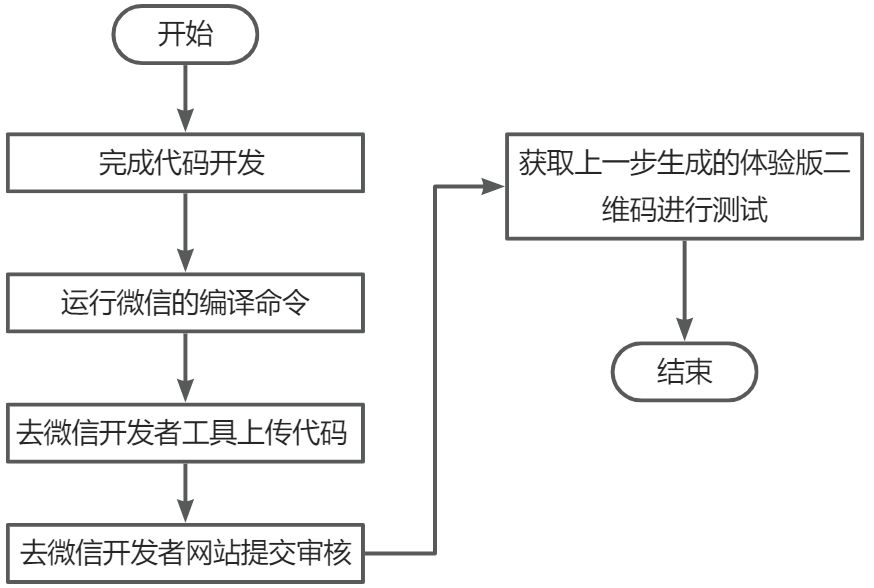

## 一、准备
### 1、注册 登录
> 在微信小程序官网注册账号，注册完成进行登录。

### 2、获取AppID
> AppID 作为一个唯一标识，在后面小程序开发里面起到贯穿始终的作用，注册登录进去后，左侧-开发 模块，'开发设置'里面可以获取到AppID。也可申请一个测试号，[测试号申请](https://developers.weixin.qq.com/miniprogram/dev/devtools/sandbox.html)

### 3、项目开发
> 可以使用市场上已经存在的框架或者原生的小程序代码进行开发，下载微信开发者工具，在微信开发者工具中设置好AppID，项目编译之后运行在开发工具里面，没问题的话 点击 上传 即可把编译之后的代码上传到个人账号里面。

### 4、项目上线
> 在 微信开发者工具 中上传代码，首先进行基础设置：应用名称、icon等，然后点击提交审核，等待一段时间（半天左右），如果通过审核，则可以把你审核通过的代码上传到线上版本。也可以使用`taro-deploy`进行自动化上线。

## 二、taro项目搭建
### 1、安装taro脚手架
> 注意：项目中的版本号一定要和系统安装的版本保持一致，不然项目运行不起来

`npm i -g @tarojs/cli`
### 2、生成项目模板，并预览
#### （1）运行命令,  my-weapp 可以自己随便写，是目录名称
`taro init my-weapp`
#### （2）项目结构
```code
|── dist                        编译结果目录
|
|── config                      项目编译配置目录
|   ├── index.js                默认配置
|   ├── dev.js                  开发环境配置
|   └── prod.js                 生产环境配置
|
|── src                         源码目录
|   ├── pages                   页面文件目录
|   |   └── index               index 页面目录
|   |       ├── index.ts        index 页面逻辑
|   |       ├── index.scss       index 页面样式
|   |       └── index.config.ts index 页面配置
|   |
|   ├── app.ts                  项目入口文件
|   ├── app.scss                 项目总通用样式
|   └── app.config.ts           项目入口配置
|
|── project.config.json         微信小程序项目配置 project.config.json
├── project.tt.json             字节跳动小程序项目配置 project.tt.json
├── project.swan.json           百度小程序项目配置 project.swan.json
├── project.qq.json             QQ 小程序项目配置 project.qq.json
|
├── babel.config.js             Babel 配置
├── tsconfig.json               TypeScript 配置
├── .eslintrc                   ESLint 配置
|
└── package.json
```

#### （3）运行、预览
> 1. 运行命令编译：`yarn dev:weapp`
> 2. 打开 微信开发者工具 ，选择项目的根目录，例如：my-weapp，即可运行，
> 3. 另外如果有报错，可以按照官网提示，需要注意开发者工具的项目设置：
> - 需要设置关闭 ES6 转 ES5 功能，开启可能报错
> - 需要设置关闭上传代码时样式自动补全，开启可能报错
> - 需要设置关闭代码压缩上传，开启可能报错

### 3、全局模块
#### （1）通用组件(components)
> 如：/src/components/d-page

#### （2）定义通用样式，src/app.scss
```css
/*定义  */
$color: rgb(231, 106, 4);
$mini: 30px;
$middle: 35px;
$big: 45px;
$borderRadius: 10px;
$borderColor: #ededed;


/*使用  */
@import '../../app.scss'
.mine {
  color: $color;
}
```
#### （3）定义通用 src/utils

- 数据缓存：storage
- 数据请求方法： request
- 路由：taroNavigate
#### （4）定义全局常量  src/contants

- storageKey
#### （5）定义环境变量
> 方便统一切换不同环境域名 src/api

- 切换不同环境的host：apiConfigp

.......
### 4、集成状态管理工具 dva

1. 安装依赖 `yarn add dva-core dva-loading`
2. 配置 -- 创建 src/store/index.ts

```javascript
import { create } from 'dva-core';
import createLoading from 'dva-loading';

let app, store, dispatch, registered;

const createApp = (options?: any) => {
  const { models } = options;

  app = create({ ...options })
  app.use(createLoading({}))

  if (!registered) {
    models.forEach((model) => app.model(model))
  }

  registered = true;

  app.start()

  store = app._store;
  app.getStore = () => store

  dispatch = store.dispatch;
  app.dispatch = dispatch;

  return app
}

export default {
  createApp,
  getDispatch() {
    return app.dispatch
  }
}
```

1. 初始化dva
- 新建 src/store/models/user.ts

```javascript
// models/user.ts
export default {
  namespace: 'user',
  state: {
    userInfo: null
  },
  effects: {
    // 这里是异步操作
  },
  reducers: {
    setUserInfo(state, {payload}) {
      return {...state, userInfo: payload}
    }
  }
}

// models/index.ts
import user from "./user";

export default [
  user
]
```

- 注册 dva 修改`src/app.ts`

```javascript
// ...
import { Provider } from 'react-redux';
import dva from './store/index';
import models from './store/models';
import Storage from './utils/storage';
const dvaApp = dva.createApp({
  initialState: {},
  models
});
Storage.globalData.globalApp = store;

// ....
render() {
  return (
    <Provider store={store}>
    	{this.props.children}
		</Provider>
	)
}
```

1. 使用
- 使用 react-redux 导出 `connect` 方法进行组件绑定
- 注意：使用`connect`绑定的组件，需要使用`forwardRef`hooks导出，否则会报错

```javascript
import { connect } from 'react-redux'; // 关键代码

const MineView: FC<IMineProps> = ({
  loading,
  user,
  dispatch,
  ...props
}, ref: any) => {

  const [userInfo, setUserInfo] = useState<any>(null)


  const handleMock = async () => {
    const res: any = await request({
      url: 'https://miniapp.com',
      header: { 'Access-Control-Allow-Origin': '*' }
    }) || {}
    if (res?.statusCode === 200) {
      // 关键代码
      dispatch({ type: 'user/setUserInfo', payload: { ...res.data } })
    }
  }

  return (
    <PageContain className='mine'>
      <Button onClick={handleMock}>mock</Button>
    </PageContain>
  )
}

// 关键代码
export default connect(({ loading, user, dispatch }: any) => ({
  loading,
  user,
  dispatch
}))(memo(forwardRef(MineView))) 


```
### 5、集成taro-ui

- 注意：由于引用 `node_modules` 的模块，默认不会编译，所以需要额外给 H5 配置 `esnextModules`，在 taro 项目的 `config/index.js` 中新增如下配置项：

```
h5: {
  esnextModules: ['taro-ui']
}
```

- 另外： 如果使用的是Taro3.x，那么taro-ui也得使用3.x
- 安装依赖： `yarn add taro-ui`
- 按需引入组件并使用： `import { AtButton } from 'taro-ui'`
- 引入样式文件的三个方式
> 1. 全局引入方法一（js中）：在入口文件中引入taro-ui的所有样式
> - `import 'taro-ui/dist/style/index.scss' // 引入组件样式 - 方式一`
> 2. 全局引入方法二（css中）：在app.scss样式文件中`import`组件样式并按照文档说明使用
> - `@import "~taro-ui/dist/style/index.scss"; // 引入组件样式 - 方式二`
> 3. 按需引入：在页面样式或全局样式中`import`需要的组件样式，个人比较推荐这个方式
> - @import "~taro-ui/dist/style/components/button.scss"; // 引入所需的组件样式 - 方式三

### 6、分包设置

- 注意点
> 1. 注册到子包的，就不用在pages对象里边书写了

- 配置步骤
1. 在src目录下创建子包目录，例如news，auth
2. 修改`src/app.config.ts`，例如

```javascript
export default {
  // ...
	// 注册子包
  subPackages: [
    {
      root: 'auth',
      name: 'auth',
      pages: [
        'login/index'
      ]
    },
    {
      root: 'news',
      name: 'news',
      pages: [
        'message/index'
      ]
    }
  ],
  //预加载包规则
  preloadRule: {
    'pages/index/index': {
      'network': 'all',
      'packages': ['auth']
    },
    'pages/mine/index': {
      'network': 'all',
      'packages': ['news']
    }
  },
  // ...
```

- 验证分包、预加载结果

在 微信开发者工具 -> console 可以看到 
> 1. `[system] No. of subpackages: 2`
> 2. `preloadSubpackages: auth`
> 3. `preloadSubpackages: success`
> 4. `preloadSubpackages: news`
> 5. `preloadSubpackages: success`

### 7、登录模块
#### （1）微信小程序登录流程
> 小程序可以通过微信官方提供的登录能力方便地获取微信提供的用户身份标识，快速建立小程序内的用户体系

- 流程图


- 流程说明
#### （2）使用Taro API 进行登录流程
> 1. 点击授权，拉取获取手机号信息
> 2. 调用Taro.getUserInfo({})，获取用户信息
> 3. 调用Taro.login()，获取code
> 4. 调用接口获取用户解密数据
> 5. 使用解密信息调用登录接口进行登录

### 8、项目配置
#### （1）编译配置
> 1. 通用配置：config/index.js
> 2. 项目预览配置(dev)： config/dev.js
> 3. 项目构建配置(build)：config/prod.js

#### （2）尺寸适配

- 尺寸适配规则
> 1. 在Taro中尺寸单位建议使用px、百分比%，Taro默认会对所有单位进行转换。在Taro中书写尺寸按照1:1的关系进行书写，即设计稿上的尺寸。例如设计稿是100px，尺寸书写成100px，当转换成小程序的时候，尺寸默认转换成100rpx，当转换成H5时默认转换为以rem为单位的值。
> 2. 如果希望部分`px`单位不转换成`rpx`或者`rem`，最简单的做法是在`px`单位中增加一个大写字母，例如`Px`或者`PX`，这样就会被转换插件忽略。
> 3. Taro默认以 750px 作为换算尺寸标准，如果设计稿不是以 750px 为标准，则需要在项目`config/indx.js`中进行设置。例如设计稿尺寸是 640px ，则需要修改项目配置`config/index.js`中的`designWidth: 640`。

- **目前 Taro 支持 750、 640 、 828 三种尺寸设计稿**
#### （3）路径配置

```javascript
module.exports = {
  // ...
  alias: {
    '@/actions': path.resolve(__dirname, '..', 'src/actions'),
    '@/components': path.resolve(__dirname, '..', 'src/components'),
    '@/utils': path.resolve(__dirname, '..', 'src/utils'),
    '@/package': path.resolve(__dirname, '..', 'package.json'),
    '@/project': path.resolve(__dirname, '..', 'project.config.json'),
  }
}
```
#### （4）优化打包配置，减少vendors体积

- 修改config/prod.js

```javascript
// ...
mini: {
    webpackChain(chain) {
      chain.merge({
        optimization: {
          splitChunks: {
            chunks: 'async',
            minSize: 20000,
            minRemainingSize: 0,
            minChunks: 1,
            maxAsyncRequests: 30,
            maxInitialRequests: 30,
            enforceSizeThreshold: 50000,
            cacheGroups: {
              lib: {
                name: 'lib',
                chunks: 'all',
                test: /[\\/]node_modules[\\/](react|react-dom|dva|dva-core|dva-loading|redux|react-redux|taro-ui)[\\/]/,
                priority: 10,
              },
              vendors: {
                name: 'vendors',
                test: /[\\/]node_modules[\\/]/,
                priority: 0,
                chunks: 'all',
                reuseExistingChunk: true,
              },
            },
          }
        }
      })
    },
    commonChunks: ['vendors', 'lib', 'runtime', 'taro', 'common']
  },
```
## 三、项目上线
### 1、手动上线
> 1. 使用 微信开发者工具，右上角 详情 里面设置好 APPID，之后就可以点击 右上角 上传， 即可把编译之后的代码上传到 小程序开发平台。
> 2. 打开 小程序管理平台，左侧 管理， 在 版本管理 里面就可以把测试版提交审核

- 流程图


### 2、taro-deploy自动化上线
