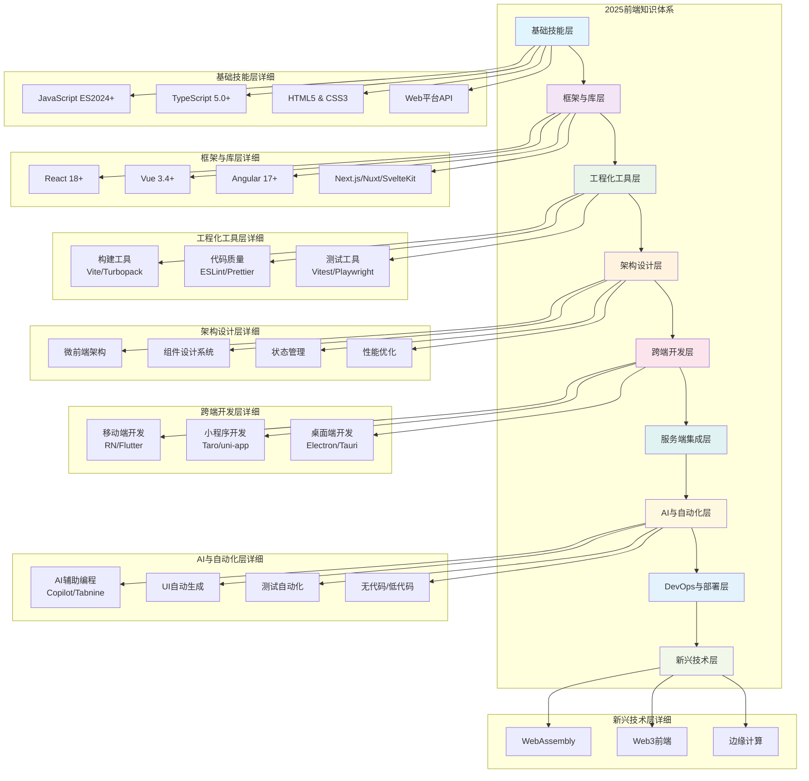
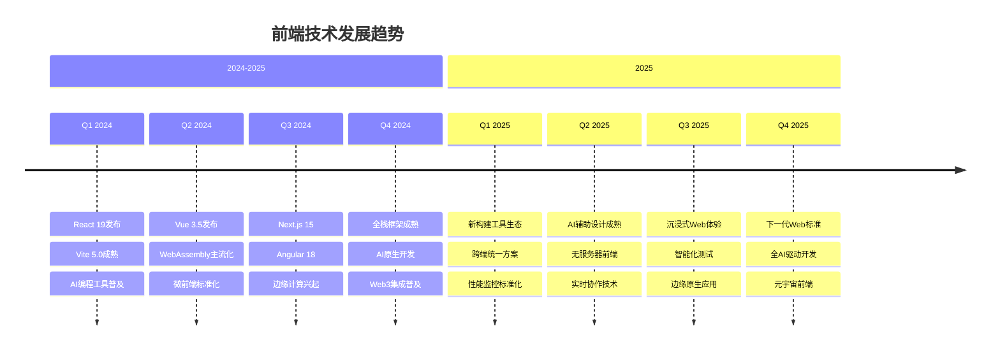
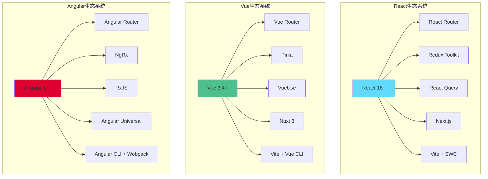
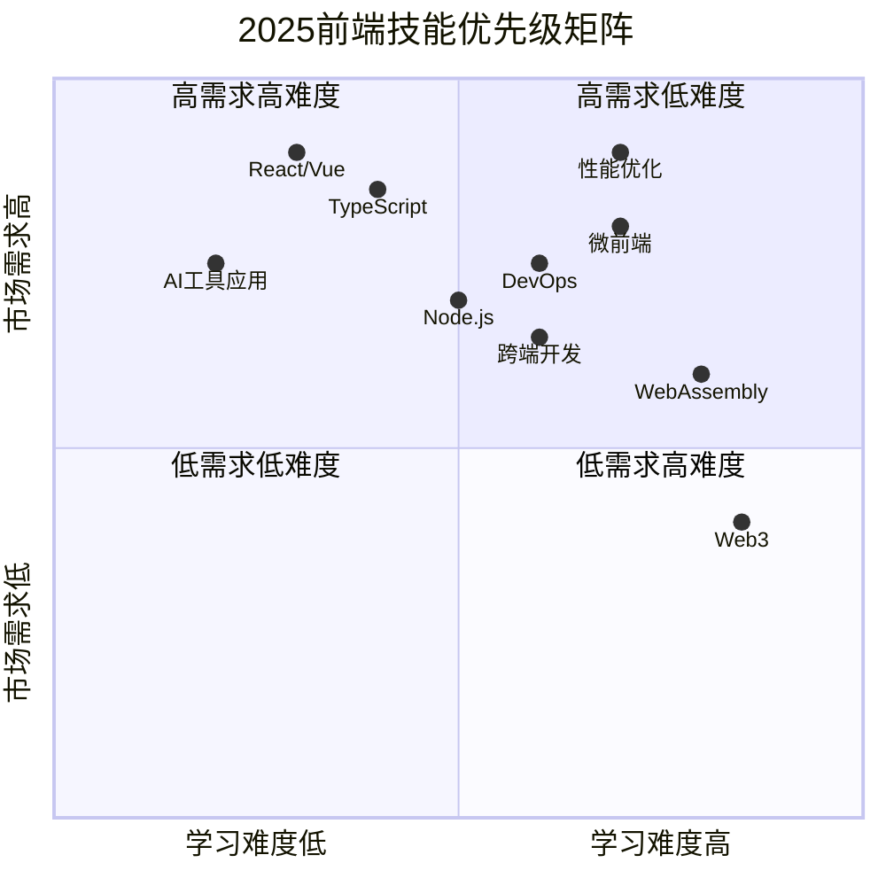

# 🚀 2025年前端开发知识体系图

> **一个全面的前端技术学习路线图，助力开发者在AI时代保持技术竞争力**

## 📋 目录
- [概述](#概述)
- [技术发展趋势分析](#技术发展趋势分析)
- [知识体系架构总览](#知识体系架构总览)
- [技能发展路径图](#技能发展路径图)
- [技术趋势时间线](#技术趋势时间线)
- [知识体系详细架构](#知识体系详细架构)
- [主流框架技术栈对比](#主流框架技术栈对比)
- [技能优先级矩阵](#技能优先级矩阵)
- [学习路径建议](#学习路径建议)
- [技能矩阵评估](#技能矩阵评估)
- [职业发展方向](#职业发展方向)
- [学习资源推荐](#学习资源推荐)
- [职业发展建议](#职业发展建议)
- [常见问题解答](#常见问题解答)

## 🎯 概述

本知识体系图旨在为前端开发者提供2025年必备的技术栈和发展路径指南。随着AI、WebAssembly、边缘计算等新技术的成熟，前端开发正朝着更加智能化、高性能化的方向发展。

### 💡 使用指南
- **初学者**: 重点关注基础技能层和框架层
- **进阶者**: 专注架构设计和跨端开发
- **资深者**: 探索AI自动化和新兴技术

## 技术发展趋势分析

### 🔥 核心趋势
- **AI原生开发**：AI辅助编程、智能UI生成、自动化测试
- **全栈融合**：前端开发者需要掌握更多后端和DevOps技能
- **性能优化**：Core Web Vitals、用户体验指标成为核心关注点
- **多端统一**：一套代码运行在Web、移动端、桌面端
- **微前端成熟**：大型企业级应用的标准架构模式
- **边缘计算**：CDN边缘渲染、分布式架构
- **Web3集成**：区块链、去中心化应用的前端实现

## 知识体系架构

### 1. 基础技能层 (Foundation Layer)

## 知识体系架构总览



## 技能发展路径图

```mermaid
graph LR
    subgraph "初级开发者 0-2年"
        J1[JavaScript基础] --> J2[HTML/CSS]
        J2 --> J3[一个主流框架]
        J3 --> J4[基础工程化]
    end

    subgraph "中级开发者 2-5年"
        M1[框架生态深入] --> M2[状态管理]
        M2 --> M3[构建工具]
        M3 --> M4[性能优化]
        M4 --> M5[微前端接触]
    end

    subgraph "高级开发者 5年+"
        S1[架构设计] --> S2[跨端开发]
        S2 --> S3[全栈技能]
        S3 --> S4[AI工具集成]
        S4 --> S5[技术领导力]
    end

    J4 --> M1
    M5 --> S1

    style J1 fill:#bbdefb
    style M1 fill:#c8e6c9
    style S1 fill:#ffcdd2
```



## 技术趋势时间线


#### 编程语言基础
- **JavaScript (ES2024+)**
  - 最新语法特性（装饰器、管道操作符、Records & Tuples）
  - 异步编程（Promise、async/await、Generators）
  - 函数式编程范式
  - 模块系统（ESM、CommonJS）

- **TypeScript 5.0+**
  - 高级类型系统
  - 泛型编程
  - 装饰器元编程
  - 类型体操与实用工具类型

- **HTML5 & CSS3**
  - 语义化HTML
  - CSS Grid & Flexbox
  - CSS-in-JS
  - CSS Module & PostCSS
  - CSS 变量与主题切换

#### Web平台API
- **现代Web API**
  - Web Components
  - Service Workers & PWA
  - Web Workers & SharedArrayBuffer
  - WebRTC & WebSocket
  - File System Access API
  - Web Streams API

### 2. 框架与库层 (Framework Layer)

#### 主流框架
- **React 18+**
  - Concurrent Features
  - Server Components
  - Suspense & Error Boundaries
  - React Query/SWR
  - Zustand/Redux Toolkit

- **Vue 3.4+**
  - Composition API
  - Pinia状态管理
  - Vite构建工具
  - Vue DevTools

- **Angular 17+**
  - Standalone Components
  - Signals
  - Angular Universal
  - RxJS响应式编程

#### 新兴框架
- **Next.js 14+**
  - App Router
  - Server Actions
  - Turbopack
  - 边缘运行时

- **Nuxt 3**
  - 全栈开发
  - 自动导入
  - TypeScript原生支持

- **SvelteKit**
  - 编译时优化
  - 轻量级运行时
  - 渐进式增强

- **Solid.js**
  - 细粒度响应式
  - 编译时优化
  - 零虚拟DOM

### 3. 工程化工具层 (Tooling Layer)

#### 构建工具
- **新一代构建工具**
  - Vite 5.0+
  - Turbopack
  - esbuild
  - SWC
  - Rspack

- **传统构建工具**
  - Webpack 5+
  - Rollup
  - Parcel

#### 开发工具
- **代码质量**
  - ESLint 9+
  - Prettier
  - Husky
  - lint-staged
  - Biome

- **类型检查**
  - TypeScript
  - Flow
  - JSDoc

- **测试工具**
  - Vitest
  - Jest
  - Cypress
  - Playwright
  - Testing Library

### 4. 架构设计层 (Architecture Layer)

#### 应用架构
- **微前端架构**
  - Module Federation
  - qiankun
  - single-spa
  - Bit

- **组件设计**
  - 设计系统构建
  - Storybook
  - 原子设计理论
  - 可访问性设计

- **状态管理**
  - 客户端状态（Zustand、Jotai）
  - 服务端状态（React Query、SWR）
  - 全局状态（Redux Toolkit、Pinia）

#### 性能优化
- **Core Web Vitals**
  - LCP、FID、CLS优化
  - 首屏渲染优化
  - 交互体验优化

- **加载优化**
  - 代码分割
  - 懒加载
  - 预加载策略
  - 缓存策略

### 5. 跨端开发层 (Cross-Platform Layer)

#### 移动端开发
- **跨端框架**
  - React Native
  - Flutter Web
  - Ionic
  - Capacitor

- **小程序开发**
  - 微信小程序
  - 支付宝小程序
  - 字节跳动小程序
  - Taro/uni-app

#### 桌面端开发
- **Electron**
- **Tauri**
- **Flutter Desktop**
- **Progressive Web Apps**

### 6. 服务端集成层 (Backend Integration)

#### API设计与集成
## 🛠️ 核心技术深度解析

### JavaScript ES2024+ 新特性详解

#### Records & Tuples (提案阶段)
```javascript
// Records - 不可变对象
const user = #{
  name: "张三",
  age: 25,
  email: "zhangsan@example.com"
};

// Tuples - 不可变数组
const coordinates = #[120.15, 30.28];

// 用途：状态管理、缓存键值
const cacheKey = #{ userId: 123, timestamp: Date.now() };
```

#### 装饰器 (Decorators)
```javascript
// 类装饰器
@logged
@cached
class UserService {
  @validate
  @rateLimit(100)
  async getUser(id) {
    return await fetch(`/api/users/${id}`);
  }
}

// 实际应用场景
@Component({
  selector: 'user-profile',
  template: './user-profile.html'
})
class UserProfileComponent {
  @Input() userId: string;
  @Output() userLoaded = new EventEmitter();
}
```

#### 管道操作符 (Pipeline Operator)
```javascript
// 传统写法
const result = Math.round(Math.max(0, parseFloat(input.trim())));

// 管道操作符写法
const result = input
  |> %.trim()
  |> parseFloat(%)
  |> Math.max(0, %)
  |> Math.round(%);

// 在数据处理中的应用
const processUserData = users
  |> %.filter(u => u.active)
  |> %.map(u => ({ ...u, fullName: `${u.firstName} ${u.lastName}` }))
  |> %.sort((a, b) => a.fullName.localeCompare(b.fullName));
```

### TypeScript 5.0+ 高级特性

#### 泛型约束与条件类型
```typescript
// 深度获取对象属性类型
type DeepKeyOf<T> = {
  [K in keyof T]: T[K] extends object 
    ? `${K & string}.${DeepKeyOf<T[K]> & string}`
    : K & string
}[keyof T];

// 使用示例
interface User {
  profile: {
    personal: {
      name: string;
      age: number;
    };
    settings: {
      theme: 'light' | 'dark';
    };
  };
}

type UserKeys = DeepKeyOf<User>; 
// "profile.personal.name" | "profile.personal.age" | "profile.settings.theme"

// 实用工具类型
type ApiResponse<T> = {
  data: T;
  status: 'success' | 'error';
  message?: string;
  timestamp: number;
};

type UserResponse = ApiResponse<User>;
```

#### 模板字面量类型
```typescript
// API路径类型生成
type ApiEndpoint = 
  | `users/${string}`
  | `posts/${string}/comments`
  | `orders/${number}`;

// CSS类名类型安全
type ButtonVariant = 'primary' | 'secondary' | 'danger';
type ButtonSize = 'sm' | 'md' | 'lg';
type ButtonClass = `btn-${ButtonVariant}-${ButtonSize}`;

// 实际组件中的应用
interface ButtonProps {
  className?: ButtonClass;
  variant: ButtonVariant;
  size: ButtonSize;
}
```

### React 18+ 深度实践

#### 并发特性应用
```jsx
import { startTransition, useDeferredValue, Suspense } from 'react';

// 优化搜索性能
function SearchResults({ query }) {
  const deferredQuery = useDeferredValue(query);
  const results = useSearch(deferredQuery);
  
  return (
    <Suspense fallback={<SearchSkeleton />}>
      <ResultsList results={results} />
    </Suspense>
  );
}

// 非阻塞状态更新
function TodoApp() {
  const [todos, setTodos] = useState([]);
  
  const addTodo = (newTodo) => {
    startTransition(() => {
      setTodos(prev => [...prev, newTodo]);
    });
  };
  
  return (
    <div>
      <AddTodoForm onAdd={addTodo} />
      <TodoList todos={todos} />
    </div>
  );
}
```

#### Server Components 实战
```jsx
// app/posts/page.tsx (Server Component)
async function PostsPage() {
  const posts = await fetch('https://api.example.com/posts');
  
  return (
    <div>
      <h1>最新文章</h1>
      {posts.map(post => (
        <PostCard key={post.id} post={post} />
      ))}
    </div>
  );
}

// 客户端组件标记
'use client';
import { useState } from 'react';

function InteractiveButton() {
  const [count, setCount] = useState(0);
  
  return (
    <button onClick={() => setCount(c => c + 1)}>
      点击次数: {count}
    </button>
  );
}
```

### 微前端架构实践案例

#### qiankun 完整配置
```javascript
// 主应用配置
import { registerMicroApps, start } from 'qiankun';

registerMicroApps([
  {
    name: 'user-center',
    entry: '//localhost:3001',
    container: '#subapp-viewport',
    activeRule: '/user',
    props: {
      routerBase: '/user',
      getGlobalState: () => store.getState()
    }
  },
  {
    name: 'order-system',
    entry: '//localhost:3002',
    container: '#subapp-viewport',
    activeRule: '/order'
  }
]);

// 全局状态共享
import { initGlobalState } from 'qiankun';

const actions = initGlobalState({
  user: null,
  theme: 'light'
});

// 子应用配置
// webpack.config.js
module.exports = {
  output: {
    library: `${name}-[name]`,
    libraryTarget: 'umd',
    chunkLoadingGlobal: `webpackJsonp_${name}`,
  },
};

// 生命周期函数
export async function bootstrap() {
  console.log('微应用启动');
}

export async function mount(props) {
  ReactDOM.render(<App />, props.container);
}

export async function unmount(props) {
  ReactDOM.unmountComponentAtNode(props.container);
}
```

#### Module Federation 实战
```javascript
// webpack.config.js (宿主应用)
const ModuleFederationPlugin = require('@module-federation/webpack');

module.exports = {
  plugins: [
    new ModuleFederationPlugin({
      name: 'host',
      remotes: {
        userCenter: 'userCenter@http://localhost:3001/remoteEntry.js',
        orderSystem: 'orderSystem@http://localhost:3002/remoteEntry.js'
      }
    })
  ]
};

// 远程模块配置 (远程应用)
new ModuleFederationPlugin({
  name: 'userCenter',
  filename: 'remoteEntry.js',
  exposes: {
    './UserProfile': './src/components/UserProfile',
    './UserList': './src/components/UserList'
  },
  shared: {
    react: { singleton: true },
    'react-dom': { singleton: true }
  }
});

// 动态导入远程组件
const UserProfile = React.lazy(() => import('userCenter/UserProfile'));

function App() {
  return (
    <Suspense fallback={<div>加载中...</div>}>
      <UserProfile userId="123" />
    </Suspense>
  );
}
```

### 性能优化实战技巧

#### Core Web Vitals 优化
```javascript
// LCP 优化 - 预加载关键资源
// HTML头部
<link rel="preload" href="/hero-image.jpg" as="image">
<link rel="preload" href="/critical.css" as="style">

// 图片优化
const OptimizedImage = ({ src, alt, ...props }) => {
  return (
    <picture>
      <source srcSet={`${src}?format=webp`} type="image/webp" />
      <source srcSet={`${src}?format=avif`} type="image/avif" />
      
    </picture>
  );
};

// FID 优化 - 代码分割
const HeavyComponent = React.lazy(() => 
  import('./HeavyComponent').then(module => ({
    default: module.HeavyComponent
  }))
);

// CLS 优化 - 占位符
const ImageWithPlaceholder = ({ src, alt, width, height }) => {
  const [loaded, setLoaded] = useState(false);
  
  return (
    <div style={{ width, height, position: 'relative' }}>
      {!loaded && (
        <div 
          style={{ 
            width: '100%', 
            height: '100%', 
            backgroundColor: '#f0f0f0',
            display: 'flex',
            alignItems: 'center',
            justifyContent: 'center'
          }}
        >
          加载中...
        </div>
      )}
       setLoaded(true)}
      />
    </div>
  );
};
```

#### 虚拟化长列表
```jsx
import { FixedSizeList as List } from 'react-window';

const VirtualizedList = ({ items }) => {
  const Row = ({ index, style }) => (
    <div style={style}>
      <ItemComponent item={items[index]} />
    </div>
  );
  
  return (
    <List
      height={600}
      itemCount={items.length}
      itemSize={80}
      width="100%"
    >
      {Row}
    </List>
  );
};

// 自定义虚拟滚动Hook
function useVirtualList(items, containerHeight, itemHeight) {
  const [scrollTop, setScrollTop] = useState(0);
  
  const visibleStart = Math.floor(scrollTop / itemHeight);
  const visibleEnd = Math.min(
    visibleStart + Math.ceil(containerHeight / itemHeight),
    items.length - 1
  );
  
  const visibleItems = items.slice(visibleStart, visibleEnd + 1);
  
  return {
    visibleItems,
    startIndex: visibleStart,
    endIndex: visibleEnd,
    totalHeight: items.length * itemHeight,
    offsetY: visibleStart * itemHeight,
    onScroll: (e) => setScrollTop(e.target.scrollTop)
  };
}
```

### AI 工具集成实例

#### GitHub Copilot 最佳实践
```javascript
// 编写清晰的注释来引导AI
/**
 * 创建一个防抖函数，用于优化搜索输入
 * @param {Function} func - 要防抖的函数
 * @param {number} delay - 延迟时间(ms)
 * @returns {Function} 防抖后的函数
 */
function debounce(func, delay) {
  let timeoutId;
  return function (...args) {
    clearTimeout(timeoutId);
    timeoutId = setTimeout(() => func.apply(this, args), delay);
  };
}

// 使用类型定义引导AI生成
interface UserProfile {
  id: string;
  name: string;
  email: string;
  avatar?: string;
  preferences: {
    theme: 'light' | 'dark';
    language: string;
  };
}

// AI会根据类型定义生成相应的函数
function createUserProfile(userData: Partial<UserProfile>): UserProfile {
  // AI生成的代码...
}
```

#### 自动化测试生成
```javascript
// 使用 AI 生成测试用例的模板
describe('UserService', () => {
  let userService: UserService;
  
  beforeEach(() => {
    userService = new UserService();
  });
  
  // AI 会根据函数签名生成测试
  describe('getUserById', () => {
    it('should return user when valid id provided', async () => {
      // 测试正常情况
    });
    
    it('should throw error when invalid id provided', async () => {
      // 测试异常情况
    });
    
    it('should handle network errors gracefully', async () => {
      // 测试网络错误
    });
  });
});
```

### 构建工具配置实例

#### Vite 5.0 高级配置
```javascript
// vite.config.js
import { defineConfig } from 'vite';
import react from '@vitejs/plugin-react-swc';
import { resolve } from 'path';

export default defineConfig({
  plugins: [
    react(),
    // 自定义插件示例
    {
      name: 'auto-import-components',
      transform(code, id) {
        if (id.endsWith('.tsx')) {
          // 自动导入组件逻辑
        }
      }
    }
  ],
  build: {
    rollupOptions: {
      output: {
        // 分包策略
        manualChunks: {
          vendor: ['react', 'react-dom'],
          ui: ['antd', '@ant-design/icons'],
          utils: ['lodash', 'moment']
        }
      }
    },
    // 代码分割阈值
    chunkSizeWarningLimit: 1000
  },
  optimizeDeps: {
    include: ['lodash-es', 'antd/es/**']
  },
  server: {
    proxy: {
      '/api': {
        target: 'http://localhost:3000',
        changeOrigin: true,
        rewrite: (path) => path.replace(/^\/api/, '')
      }
    }
  }
});
```

#### Webpack 5 Federation 配置
```javascript
const ModuleFederationPlugin = require('@module-federation/webpack');

module.exports = {
  mode: 'development',
  devServer: {
    port: 3001,
  },
  plugins: [
    new ModuleFederationPlugin({
      name: 'shell',
      filename: 'remoteEntry.js',
      remotes: {
        mfe1: 'mfe1@http://localhost:3002/remoteEntry.js',
        mfe2: 'mfe2@http://localhost:3003/remoteEntry.js',
      },
      exposes: {
        './Button': './src/components/Button',
        './utils': './src/utils/index',
      },
      shared: {
        react: {
          singleton: true,
          strictVersion: true,
          requiredVersion: '^18.0.0',
        },
        'react-dom': {
          singleton: true,
          strictVersion: true,
          requiredVersion: '^18.0.0',
        },
      },
    }),
  ],
};
```
- **RESTful API**
- **GraphQL**
- **gRPC-Web**
- **WebSocket实时通信**

#### 全栈开发
- **Node.js生态**
  - Express/Koa
  - NestJS
  - Fastify

- **边缘运行时**
  - Cloudflare Workers
  - Vercel Edge Functions
  - Deno Deploy

- **数据库集成**
  - Prisma
  - TypeORM
  - Supabase

### 7. AI与自动化层 (AI & Automation Layer)

#### AI辅助开发
- **代码生成**
  - GitHub Copilot
  - Tabnine
  - CodeT5

- **UI生成**
  - Figma to Code
  - Sketch2Code
  - AI设计系统

- **测试自动化**
  - AI测试用例生成
  - 视觉回归测试
  - 智能Bug检测

#### 无代码/低代码
- **可视化开发**
- **拖拽式组件**
- **配置化表单**

### 8. DevOps与部署层 (DevOps Layer)

#### CI/CD
- **GitHub Actions**
- **GitLab CI**
- **Jenkins**
- **Docker容器化**

#### 部署平台
- **云服务**
  - Vercel
  - Netlify
  - AWS Amplify
  - 阿里云/腾讯云

- **CDN优化**
- **监控与日志**
  - Sentry
  - LogRocket
  - DataDog

### 9. 新兴技术层 (Emerging Technologies)

#### WebAssembly
- **Rust/Go编译到WASM**
- **性能密集型计算**
- **图像/视频处理**

#### Web3前端
- **钱包集成**
- **智能合约交互**
- **DApp开发**
- **IPFS集成**

#### 边缘计算
- **CDN边缘渲染**
- **分布式前端架构**
- **边缘侧缓存策略**

## 学习路径建议

### 初级开发者 (0-2年)
1. 掌握JavaScript/TypeScript基础
2. 学习一个主流框架（React/Vue）
3. 熟悉HTML/CSS/响应式设计
4. 了解基础工程化工具

### 中级开发者 (2-5年)
1. 深入框架生态系统
2. 掌握状态管理和路由
3. 学习构建工具和性能优化
4. 接触微前端架构

### 高级开发者 (5年+)
1. 架构设计能力
2. 跨端开发经验
3. 全栈技能培养
4. AI工具集成应用

## 技能矩阵评估

### 必备技能 (⭐⭐⭐)
- JavaScript/TypeScript
- 主流框架精通
- 工程化工具链
- 性能优化

### 重要技能 (⭐⭐)
- 微前端架构
- 跨端开发
- 测试驱动开发
- DevOps基础

### 加分技能 (⭐)
- WebAssembly
- AI工具应用
- Web3开发
- 边缘计算

## 职业发展方向

### 技术专家路线
- **前端架构师**
- **全栈工程师**  
- **技术专家/技术总监**

### 产品导向路线
- **前端技术产品经理**
- **用户体验工程师**
- **技术创业者**

## 总结

2025年的前端开发已经从单纯的页面开发演进为复杂的工程化体系。开发者需要在保持技术深度的同时，拓展知识广度，特别是在AI、性能优化、跨端开发等新兴领域。持续学习和实践是在这个快速发展的领域中保持竞争力的关键。
## 主流框架技术栈对比



## 技能优先级矩阵



## 学习资源推荐

### 📚 官方文档与教程
- **React**: [React官方文档](https://react.dev/)
- **Vue**: [Vue.js官方指南](https://vuejs.org/)
- **TypeScript**: [TypeScript官方手册](https://www.typescriptlang.org/)
- **Web平台API**: [MDN Web Docs](https://developer.mozilla.org/)

### 🎯 实战项目建议
1. **个人博客系统** - 使用 Next.js + TypeScript + Tailwind CSS
2. **企业级管理后台** - React + Ant Design + 微前端架构
3. **跨端移动应用** - React Native 或 Flutter
4. **实时协作工具** - WebSocket + Node.js + Redis
5. **AI辅助工具** - 集成 OpenAI API 的前端应用

### 🔧 开发工具推荐
- **编辑器**: VS Code + 相关插件
- **设计**: Figma + Component Libraries
- **调试**: React DevTools, Vue DevTools
- **测试**: Vitest + Testing Library + Playwright
- **部署**: Vercel, Netlify, Docker

### 📖 推荐书籍
- 《JavaScript高级程序设计》
- 《你不知道的JavaScript》
- 《React设计原理》
- 《前端架构：从入门到微前端》
- 《Web性能权威指南》

### 🎓 在线学习平台
- **免费资源**: freeCodeCamp, MDN, JavaScript.info
- **付费课程**: Egghead, Frontend Masters, Udemy
- **实战平台**: LeetCode, CodeSandbox, StackBlitz

### 🌟 技术社区
- **GitHub**: 关注优秀开源项目
- **技术博客**: 掘金、思否、Medium
- **播客**: Syntax, JavaScript Jabber
- **会议**: JSConf, React Conf, Vue Conf

## 职业发展建议

### 🎯 短期目标（6个月内）
1. 精通一个主流框架及其生态
2. 掌握TypeScript和现代工程化工具
3. 完成2-3个有质量的项目
4. 建立个人技术品牌（博客/GitHub）

### 🚀 中期目标（1-2年内）
1. 深入理解前端架构设计
2. 培养全栈开发能力
3. 参与开源项目贡献
4. 在技术团队中承担更多责任

### 🏆 长期目标（3-5年）
1. 成为技术专家或架构师
2. 具备技术领导力和团队管理能力
3. 在某个技术领域有深度影响力
4. 考虑技术创业或产品化方向

## 常见问题解答

### Q: 应该先学React还是Vue？
A: 建议根据就业市场和个人喜好选择。React生态更庞大，Vue学习曲线更平缓。无论选择哪个，重点是理解现代前端框架的核心概念。

### Q: TypeScript是必须的吗？
A: 在2025年，TypeScript已经成为大型项目的标配。建议尽早学习，它能显著提高代码质量和开发效率。

### Q: 如何平衡技术广度和深度？
A: 建议采用"T型"发展策略：在一个领域有深度专精，同时保持对其他技术的广泛了解。

### Q: AI工具会取代前端开发者吗？
A: AI工具是前端开发者的助手而非替代。学会使用AI工具提高效率，同时专注于创意、架构设计和用户体验等AI难以替代的领域。

## 结语

前端技术发展日新月异，保持学习的热情和开放的心态是最重要的。这个知识体系图为您提供了一个全面的技术路线图，但真正的成长来自于持续的实践和思考。

记住：技术是手段，解决问题和创造价值才是目标。在追求技术深度的同时，不要忘记关注用户体验和业务价值的实现。

**愿每位前端开发者都能在2025年的技术浪潮中找到属于自己的位置，创造出令人惊艳的Web体验！**

---

*本知识体系图基于2025年技术趋势分析制作，会根据技术发展持续更新。如有建议或补充，欢迎贡献！*
## 🚀 跨端开发实战案例

### React Native 新架构 (New Architecture)
```javascript
// Fabric 渲染器配置
// react-native.config.js
module.exports = {
  project: {
    ios: {},
    android: {},
  },
  dependencies: {
    'react-native-reanimated': {
      platforms: {
        android: {
          sourceDir: '../node_modules/react-native-reanimated/android',
          packageImportPath: 'import io.realm.react.RealmReactPackage;',
        },
      },
    },
  },
};

// TurboModules 自定义模块
// NativeBridgeModule.ts
import { TurboModule, TurboModuleRegistry } from 'react-native';

export interface Spec extends TurboModule {
  calculateSum(a: number, b: number): Promise<number>;
  getDeviceInfo(): Promise<{
    model: string;
    version: string;
  }>;
}

export default TurboModuleRegistry.getEnforcing<Spec>('BridgeModule');

// 使用示例
import BridgeModule from './NativeBridgeModule';

const MyComponent = () => {
  const [result, setResult] = useState(0);
  
  useEffect(() => {
    BridgeModule.calculateSum(10, 20).then(setResult);
  }, []);
  
  return <Text>计算结果: {result}</Text>;
};
```

### Flutter Web 集成
```dart
// lib/main.dart
import 'package:flutter/material.dart';
import 'package:flutter_web_plugins/flutter_web_plugins.dart';

void main() {
  setUrlStrategy(PathUrlStrategy());
  runApp(MyApp());
}

class MyApp extends StatelessWidget {
  @override
  Widget build(BuildContext context) {
    return MaterialApp(
      title: 'Flutter Web Demo',
      theme: ThemeData(
        primarySwatch: Colors.blue,
        visualDensity: VisualDensity.adaptivePlatformDensity,
      ),
      home: ResponsiveLayout(),
    );
  }
}

// 响应式布局
class ResponsiveLayout extends StatelessWidget {
  @override
  Widget build(BuildContext context) {
    return LayoutBuilder(
      builder: (context, constraints) {
        if (constraints.maxWidth > 800) {
          return DesktopLayout();
        } else if (constraints.maxWidth > 600) {
          return TabletLayout();
        } else {
          return MobileLayout();
        }
      },
    );
  }
}
```

### Tauri 桌面应用开发
```rust
// src-tauri/src/main.rs
#![cfg_attr(not(debug_assertions), windows_subsystem = "windows")]

use tauri::Manager;

#[tauri::command]
fn greet(name: &str) -> String {
    format!("Hello, {}! You've been greeted from Rust!", name)
}

#[tauri::command]
async fn read_file(path: String) -> Result<String, String> {
    std::fs::read_to_string(path)
        .map_err(|err| err.to_string())
}

fn main() {
    tauri::Builder::default()
        .invoke_handler(tauri::generate_handler![greet, read_file])
        .setup(|app| {
            #[cfg(debug_assertions)]
            {
                let window = app.get_window("main").unwrap();
                window.open_devtools();
            }
            Ok(())
        })
        .run(tauri::generate_context!())
        .expect("error while running tauri application");
}
```

```javascript
// 前端调用 Rust 函数
import { invoke } from '@tauri-apps/api/tauri';

export const FileManager = {
  async readFile(path) {
    try {
      const content = await invoke('read_file', { path });
      return content;
    } catch (error) {
      console.error('读取文件失败:', error);
      throw error;
    }
  },
  
  async greetUser(name) {
    return await invoke('greet', { name });
  }
};

// React 组件中使用
function App() {
  const [greeting, setGreeting] = useState('');
  
  const handleGreet = async () => {
    const message = await FileManager.greetUser('前端开发者');
    setGreeting(message);
  };
  
  return (
    <div>
      <button onClick={handleGreet}>问候</button>
      <p>{greeting}</p>
    </div>
  );
}
```

## 🤖 AI 驱动开发实践

### 代码生成与自动化
```javascript
// AI 辅助生成 API 接口类型
// 根据 OpenAPI 规范自动生成
// generated/api-types.ts
export interface UserCreateRequest {
  name: string;
  email: string;
  role: 'admin' | 'user' | 'guest';
}

export interface UserResponse {
  id: string;
  name: string;
  email: string;
  role: string;
  createdAt: string;
  updatedAt: string;
}

// 自动生成的 API 客户端
class UserApi {
  async createUser(data: UserCreateRequest): Promise<UserResponse> {
    const response = await fetch('/api/users', {
      method: 'POST',
      headers: { 'Content-Type': 'application/json' },
      body: JSON.stringify(data)
    });
    return response.json();
  }
  
  async getUser(id: string): Promise<UserResponse> {
    const response = await fetch(`/api/users/${id}`);
    return response.json();
  }
}

// AI 生成的测试用例
describe('UserApi', () => {
  let userApi: UserApi;
  
  beforeEach(() => {
    userApi = new UserApi();
    // Mock fetch
    global.fetch = jest.fn();
  });
  
  it('should create user successfully', async () => {
    const mockUser: UserResponse = {
      id: '1',
      name: 'Test User',
      email: 'test@example.com',
      role: 'user',
      createdAt: '2025-01-01T00:00:00Z',
      updatedAt: '2025-01-01T00:00:00Z'
    };
    
    (fetch as jest.Mock).mockResolvedValueOnce({
      json: async () => mockUser
    });
    
    const result = await userApi.createUser({
      name: 'Test User',
      email: 'test@example.com',
      role: 'user'
    });
    
    expect(result).toEqual(mockUser);
  });
});
```

### 智能化 UI 组件生成
```jsx
// AI 生成的表单组件
const DynamicForm = ({ schema, onSubmit }) => {
  const [formData, setFormData] = useState({});
  const [errors, setErrors] = useState({});
  
  const handleSubmit = (e) => {
    e.preventDefault();
    const validation = validateSchema(formData, schema);
    if (validation.valid) {
      onSubmit(formData);
    } else {
      setErrors(validation.errors);
    }
  };
  
  const renderField = (field) => {
    switch (field.type) {
      case 'text':
        return (
          <input
            type="text"
            value={formData[field.name] || ''}
            onChange={(e) => setFormData(prev => ({
              ...prev,
              [field.name]: e.target.value
            }))}
            placeholder={field.placeholder}
            required={field.required}
          />
        );
      case 'select':
        return (
          <select
            value={formData[field.name] || ''}
            onChange={(e) => setFormData(prev => ({
              ...prev,
              [field.name]: e.target.value
            }))}
            required={field.required}
          >
            <option value="">请选择</option>
            {field.options.map(option => (
              <option key={option.value} value={option.value}>
                {option.label}
              </option>
            ))}
          </select>
        );
      default:
        return null;
    }
  };
  
  return (
    <form onSubmit={handleSubmit}>
      {schema.fields.map(field => (
        <div key={field.name} className="form-field">
          <label>{field.label}</label>
          {renderField(field)}
          {errors[field.name] && (
            <span className="error">{errors[field.name]}</span>
          )}
        </div>
      ))}
      <button type="submit">提交</button>
    </form>
  );
};

// 使用配置驱动
const userFormSchema = {
  fields: [
    {
      name: 'name',
      type: 'text',
      label: '姓名',
      placeholder: '请输入姓名',
      required: true
    },
    {
      name: 'role',
      type: 'select',
      label: '角色',
      required: true,
      options: [
        { value: 'admin', label: '管理员' },
        { value: 'user', label: '普通用户' }
      ]
    }
  ]
};
```

## 🔧 DevOps 与部署自动化

### GitHub Actions CI/CD 配置
```yaml
# .github/workflows/deploy.yml
name: Deploy Frontend

on:
  push:
    branches: [main]
  pull_request:
    branches: [main]

jobs:
  test:
    runs-on: ubuntu-latest
    steps:
      - uses: actions/checkout@v4
      
      - name: Setup Node.js
        uses: actions/setup-node@v4
        with:
          node-version: '20'
          cache: 'npm'
          
      - name: Install dependencies
        run: npm ci
        
      - name: Run tests
        run: npm run test:coverage
        
      - name: Upload coverage
        uses: codecov/codecov-action@v3
        
  build:
    needs: test
    runs-on: ubuntu-latest
    steps:
      - uses: actions/checkout@v4
      
      - name: Setup Node.js
        uses: actions/setup-node@v4
        with:
          node-version: '20'
          cache: 'npm'
          
      - name: Install dependencies
        run: npm ci
        
      - name: Build application
        run: npm run build
        env:
          REACT_APP_API_URL: ${{ secrets.API_URL }}
          
      - name: Upload build artifacts
        uses: actions/upload-artifact@v3
        with:
          name: build-files
          path: dist/
          
  deploy:
    needs: build
    runs-on: ubuntu-latest
    if: github.ref == 'refs/heads/main'
    steps:
      - name: Download build artifacts
        uses: actions/download-artifact@v3
        with:
          name: build-files
          path: dist/
          
      - name: Deploy to Vercel
        uses: vercel/action@v1
        with:
          vercel-token: ${{ secrets.VERCEL_TOKEN }}
          vercel-org-id: ${{ secrets.ORG_ID }}
          vercel-project-id: ${{ secrets.PROJECT_ID }}
```

### Docker 容器化部署
```dockerfile
# Dockerfile
# 多阶段构建
FROM node:20-alpine AS builder

WORKDIR /app
COPY package*.json ./
RUN npm ci --only=production

COPY . .
RUN npm run build

# 生产环境镜像
FROM nginx:alpine

# 复制自定义 nginx 配置
COPY nginx.conf /etc/nginx/nginx.conf

# 复制构建产物
COPY --from=builder /app/dist /usr/share/nginx/html

# 健康检查
HEALTHCHECK --interval=30s --timeout=3s --start-period=5s --retries=3 \
  CMD curl -f http://localhost/ || exit 1

EXPOSE 80

CMD ["nginx", "-g", "daemon off;"]
```

```nginx
# nginx.conf
events {
    worker_connections 1024;
}

http {
    include       /etc/nginx/mime.types;
    default_type  application/octet-stream;
    
    # Gzip 压缩
    gzip on;
    gzip_vary on;
    gzip_min_length 1024;
    gzip_types text/css text/javascript application/javascript application/json;
    
    # 缓存配置
    location ~* \.(js|css|png|jpg|jpeg|gif|ico|svg)$ {
        expires 1y;
        add_header Cache-Control "public, immutable";
    }
    
    server {
        listen 80;
        server_name localhost;
        
        root /usr/share/nginx/html;
        index index.html;
        
        # SPA 路由支持
        location / {
            try_files $uri $uri/ /index.html;
        }
        
        # API 代理
        location /api/ {
            proxy_pass http://backend:3000/;
            proxy_set_header Host $host;
            proxy_set_header X-Real-IP $remote_addr;
        }
        
        # 安全头
        add_header X-Frame-Options "SAMEORIGIN";
        add_header X-Content-Type-Options "nosniff";
        add_header X-XSS-Protection "1; mode=block";
    }
}
```

### Kubernetes 部署配置
```yaml
# k8s/deployment.yaml
apiVersion: apps/v1
kind: Deployment
metadata:
  name: frontend-app
  labels:
    app: frontend
spec:
  replicas: 3
  selector:
    matchLabels:
      app: frontend
  template:
    metadata:
      labels:
        app: frontend
    spec:
      containers:
      - name: frontend
        image: myregistry/frontend:latest
        ports:
        - containerPort: 80
        env:
        - name: API_URL
          valueFrom:
            configMapKeyRef:
              name: app-config
              key: api-url
        resources:
          requests:
            memory: "128Mi"
            cpu: "100m"
          limits:
            memory: "256Mi"
            cpu: "200m"
        livenessProbe:
          httpGet:
            path: /health
            port: 80
          initialDelaySeconds: 30
          periodSeconds: 10
        readinessProbe:
          httpGet:
            path: /ready
            port: 80
          initialDelaySeconds: 5
          periodSeconds: 5

---
apiVersion: v1
kind: Service
metadata:
  name: frontend-service
spec:
  selector:
    app: frontend
  ports:
  - protocol: TCP
    port: 80
    targetPort: 80
  type: LoadBalancer

---
apiVersion: v1
kind: ConfigMap
metadata:
  name: app-config
data:
  api-url: "https://api.example.com"
```

## 📊 监控与性能优化实践

### 错误监控与日志
```javascript
// Sentry 配置与使用
import * as Sentry from '@sentry/react';
import { BrowserTracing } from '@sentry/tracing';

Sentry.init({
  dsn: 'YOUR_SENTRY_DSN',
  integrations: [
    new BrowserTracing({
      tracePropagationTargets: ['localhost', 'api.example.com'],
    }),
  ],
  tracesSampleRate: 0.1,
  environment: process.env.NODE_ENV,
  beforeSend(event, hint) {
    // 过滤掉开发环境的错误
    if (process.env.NODE_ENV === 'development') {
      console.log('Sentry Event:', event);
      console.log('Hint:', hint);
    }
    return event;
  }
});

// 自定义错误边界
class ErrorBoundary extends React.Component {
  constructor(props) {
    super(props);
    this.state = { hasError: false };
  }
  
  static getDerivedStateFromError(error) {
    return { hasError: true };
  }
  
  componentDidCatch(error, errorInfo) {
    Sentry.withScope((scope) => {
      scope.setTag('errorBoundary', true);
      scope.setLevel('error');
      scope.setContext('errorInfo', errorInfo);
      Sentry.captureException(error);
    });
  }
  
  render() {
    if (this.state.hasError) {
      return (
        <div className="error-fallback">
          <h2>出现了错误</h2>
          <button onClick={() => this.setState({ hasError: false })}>
            重试
          </button>
        </div>
      );
    }
    
    return this.props.children;
  }
}

// 自定义钩子用于错误处理
function useErrorHandler() {
  return useCallback((error, errorInfo) => {
    Sentry.withScope((scope) => {
      scope.setLevel('error');
      if (errorInfo) {
        scope.setContext('errorInfo', errorInfo);
      }
      Sentry.captureException(error);
    });
  }, []);
}
```

### 性能监控
```javascript
// Web Vitals 监控
import { getCLS, getFID, getFCP, getLCP, getTTFB } from 'web-vitals';

function sendToAnalytics(metric) {
  // 发送到分析服务
  fetch('/api/analytics', {
    method: 'POST',
    body: JSON.stringify(metric),
    headers: { 'Content-Type': 'application/json' }
  });
}

// 监控所有核心指标
getCLS(sendToAnalytics);
getFID(sendToAnalytics);
getFCP(sendToAnalytics);
getLCP(sendToAnalytics);
getTTFB(sendToAnalytics);

// 自定义性能监控 Hook
function usePerformanceMonitor() {
  useEffect(() => {
    // 监控页面加载时间
    const observer = new PerformanceObserver((list) => {
      list.getEntries().forEach((entry) => {
        if (entry.entryType === 'navigation') {
          const loadTime = entry.loadEventEnd - entry.loadEventStart;
          sendToAnalytics({
            name: 'page_load_time',
            value: loadTime,
            url: window.location.pathname
          });
        }
      });
    });
    
    observer.observe({ entryTypes: ['navigation'] });
    
    return () => observer.disconnect();
  }, []);
}

// 资源加载监控
function useResourceMonitor() {
  useEffect(() => {
    const observer = new PerformanceObserver((list) => {
      list.getEntries().forEach((entry) => {
        if (entry.duration > 1000) { // 资源加载超过1秒
          sendToAnalytics({
            name: 'slow_resource',
            value: entry.duration,
            resource: entry.name
          });
        }
      });
    });
    
    observer.observe({ entryTypes: ['resource'] });
    
    return () => observer.disconnect();
  }, []);
}
```
---

## ⚛️ React 18+ 生态系统深度剖析

React 不再仅仅是一个 UI 库，它已经发展成为一个庞大且功能强大的生态系统。理解这个生态是成为一名高效 React 开发者的关键。以下是对 2025 年 React 18+ 生态的详细介绍。

### 1. React 核心 (v18+)

React 18 引入了并发（Concurrency）作为其核心特性，这是后续所有创新的基础。

#### 并发渲染 (Concurrent Rendering)
并发是 React 能够中断、暂停、恢复或放弃渲染更新的能力。这使得应用即使在执行大型渲染任务时也能保持对用户输入的响应。

- **`startTransition`**: 将更新标记为“过渡”，允许更紧急的更新（如用户输入）打断它。
  ```jsx
  import { startTransition } from 'react';
  
  // 用于更新不那么紧急的状态，如过滤一个大型列表
  function handleFilterChange(e) {
    const newFilter = e.target.value;
    // UI 紧急更新输入框
    setFilterInput(newFilter); 
    
    // 将列表过滤这个耗时操作标记为非紧急
    startTransition(() => {
      setFilteredList(performExpensiveFiltering(newFilter));
    });
  }
  ```
- **`useDeferredValue`**: 延迟一个值的更新，直到没有更紧急的更新。非常适合用于实现当用户输入时，UI 上的内容响应需要延迟的场景。
  ```jsx
  import { useState, useDeferredValue } from 'react';

  function Typeahead() {
    const [query, setQuery] = useState('');
    const deferredQuery = useDeferredValue(query); // 只有在用户停止输入后，deferredQuery才会更新

    return (
      <>
        <input value={query} onChange={e => setQuery(e.target.value)} />
        {/* Suspense 和 SearchResults 会使用 deferredQuery，不会阻塞输入 */}
        <Suspense fallback="Loading...">
          <SearchResults query={deferredQuery} />
        </Suspense>
      </>
    );
  }
  ```

#### React Server Components (RSC)
这是 React 近年来最大的范式转变，将组件分为在服务器和客户端上运行的两种类型。

- **服务器组件 (默认)**: 在服务器上运行，可以访问后端资源（数据库、文件系统），代码不会被打包进客户端 JS 中。非常适合获取数据和静态内容的展示。
  ```jsx
  // app/page.jsx (这是一个 Server Component)
  async function Page() {
    // 直接在组件中访问数据库或 API
    const data = await db.posts.findMany();
    
    return (
      <main>
        {data.map(post => <PostPreview key={post.id} post={post} />)}
      </main>
    );
  }
  ```
- **客户端组件**: 使用 `'use client';` 指令标记。它们在客户端运行，可以使用 Hooks (`useState`, `useEffect`) 并处理用户交互。
  ```jsx
  // components/LikeButton.jsx
  'use client';

  import { useState } from 'react';

  export function LikeButton({ initialLikes }) {
    const [likes, setLikes] = useState(initialLikes);
    
    return (
      <button onClick={() => setLikes(likes + 1)}>
        ❤️ {likes}
      </button>
    );
  }
  ```
- **核心优势**: 减少客户端 JavaScript 包体积，提升初始加载性能，改善数据获取体验。

### 2. 主流框架 (Meta-Frameworks)

直接使用 React 库本身（如通过 Create React App）已不再是主流，现代开发强烈推荐使用元框架。

- **Next.js (Vercel)**: 官方推荐的 React 框架。它无缝集成了 RSC、基于文件的路由（App Router）、服务器操作（Server Actions）、图像优化等功能。是构建任何生产级 React 应用的首选。
- **Remix (Shopify)**: 另一个强大的全栈框架，专注于 Web 基础（如 HTML 表单和 HTTP 缓存）。它的数据加载和突变模型非常出色。
- **Gatsby**: 专注于内容驱动的网站，以其强大的数据层（GraphQL）和插件生态系统而闻名，是静态网站生成（SSG）的绝佳选择。

### 3. 状态管理 (State Management)

状态管理在 React 生态中已经分化为不同类型的解决方案。

#### 服务端状态 (Server State)
这是最重要的类别。任何来自 API 的数据都应被视为服务器状态。
- **React Query (TanStack Query)**: 几乎成为事实标准。它极大地简化了数据获取、缓存、同步和更新。
  ```jsx
  import { useQuery } from '@tanstack/react-query';
  
  function UserProfile({ userId }) {
    const { data, isLoading, error, isFetching } = useQuery({
      queryKey: ['user', userId], // 缓存的 key
      queryFn: () => fetch(`/api/users/${userId}`).then(res => res.json()),
      staleTime: 5 * 60 * 1000, // 数据 5 分钟内保持新鲜
    });

    if (isLoading) return 'Loading...';
    if (error) return `An error occurred: ${error.message}`;
    
    return (
      <div>
        <h1>{data.name}</h1>
        {isFetching && <small>Updating...</small>}
      </div>
    );
  }
  ```
- **SWR (Vercel)**: 由 Vercel 开发，与 React Query 类似，但更轻量级。

#### 全局客户端状态 (Global Client State)
用于管理那些需要在多个组件间共享的、与服务器无关的状态（如主题、用户认证状态等）。
- **Zustand**: 以其极简的 API 和小巧的体积而备受青睐。
  ```jsx
  import { create } from 'zustand';

  const useThemeStore = create((set) => ({
    theme: 'light',
    toggleTheme: () => set((state) => ({ theme: state.theme === 'light' ? 'dark' : 'light' })),
  }));

  function ThemeSwitcher() {
    const { theme, toggleTheme } = useThemeStore();
    return <button onClick={toggleTheme}>Switch to {theme === 'light' ? 'dark' : 'light'}</button>;
  }
  ```
- **Jotai**: 采用原子化（Atomic）模型，状态被分解成独立的原子，可以避免大型状态对象带来的不必要重渲染。
- **Redux Toolkit**: 仍然是大型、复杂状态管理场景的强大选择，提供了可预测的状态容器和优秀的开发工具。

#### 本地状态 (Local State)
- **`useState` / `useReducer`**: 对于仅限于单个组件或其直接子组件的状态，这两个内置 Hooks 仍然是最佳选择。

### 4. 路由 (Routing)
- **React Router**: 长期以来的社区标准，功能强大且稳定。
- **TanStack Router**: 一个新兴的、完全类型安全的路由库，提供了搜索参数管理、代码分割等现代化功能，越来越受欢迎。

### 5. 样式方案 (Styling)
- **Tailwind CSS**: 目前最流行的方案。通过工具类（utility classes）直接在 JSX 中编写样式，极大地提升了开发效率和设计系统的一致性。
  ```jsx
  function Card({ children }) {
    return (
      <div className="bg-white dark:bg-gray-800 p-6 rounded-lg shadow-md hover:shadow-xl transition-shadow">
        {children}
      </div>
    );
  }
  ```
- **CSS-in-JS (e.g., Emotion, Styled-components)**: 允许在 JavaScript 中编写 CSS，提供动态样式和作用域。在 RSC 环境下使用存在一些性能挑战，但仍有其适用场景。
- **CSS Modules**: 将 CSS 文件视为模块，类名自动生成哈希值，解决了全局样式污染问题。

### 6. UI 组件库

- **Shadcn/ui**: 引领了新的趋势。它不是一个传统的组件库，而是一组你可以复制粘贴到自己项目中的、可定制的组件。这让你对组件代码有完全的控制权。
- **Ant Design**: 功能极其丰富的企业级 UI 库，提供了大量开箱即用的高质量组件，非常适合构建后台管理系统。
- **Material-UI (MUI)**: 实现了 Google 的 Material Design，是构建具有现代化观感应用的热门选择。

### 7. 测试 (Testing)

- **Vitest**: 基于 Vite 的现代化测试框架，速度快，与 Jest 的 API 高度兼容，是新项目的首选。
- **React Testing Library**: 核心理念是“测试你的软件，就像真实用户那样”。它鼓励你通过查询 DOM 元素来测试组件的行为，而不是其内部实现细节。
- **Playwright / Cypress**: 用于端到端（E2E）测试，可以模拟真实用户在浏览器中的完整操作流程。

### 8. 工具链 (Tooling)
- **Vite**: 已经取代 Webpack 成为新 React 项目的首选构建工具，提供了极快的冷启动和热模块替换（HMR）速度。
- **TypeScript**: 对于任何中大型 React 项目来说，TypeScript 都是必不可少的，它提供了类型安全，大大减少了运行时错误。

这个详细的生态系统剖析为您提供了一个更深入的视角，来理解 2025 年的 React 开发全景。
---

## ⚡️ React 18+ 新特性深度解析

React 18 的核心是一系列建立在并发渲染（Concurrent Rendering）引擎之上的新特性。这些特性共同致力于提升应用的真实和感知性能，并改善用户体验。

### 1. 并发特性 (Concurrency)

**一句话概括**: 并发是 React 18 的底层机制，它允许 React 同时准备多个版本的 UI，并且可以在渲染过程中暂停、恢复或中止，而不会阻塞主线程。

**解决了什么问题**: 在 React 18 之前，渲染是一个同步、阻塞的过程。一旦开始，就无法被打断。如果一个组件树的渲染非常耗时，整个应用就会失去响应，无法处理用户输入，导致页面卡顿。

**工作原理**:
并发本身不是一个可以直接使用的 API，而是赋能其他新特性的基础。它将渲染工作分解成小块，并在每完成一小块工作后，将控制权交还给浏览器主线程，让浏览器有机会处理更高优先级的任务，比如用户点击和键盘输入。

---

### 2. `createRoot` API

**一句话概括**: 这是启用 React 18 所有并发特性的新入口。

**解决了什么问题**: 它是向后兼容的升级路径。旧的 `ReactDOM.render` API 仍然有效，但会以传统的同步模式运行。只有使用 `createRoot`，才能开启 React 18 的并发功能。

**代码示例与最佳实践**:
```javascript
// Before (React 17 and below)
import ReactDOM from 'react-dom';
import App from './App';
const container = document.getElementById('root');
ReactDOM.render(<App />, container);

// After (React 18+)
import { createRoot } from 'react-dom/client';
import App from './App';
const container = document.getElementById('root');
const root = createRoot(container); // 创建一个 root
root.render(<App />); // 通过 root 进行渲染
```
**最佳实践**: 对于任何新的 React 18+ 项目，都应使用 `createRoot`。

---

### 3. 自动批处理 (Automatic Batching)

**一句话概括**: 为了提高性能，React 会自动将多个状态更新合并到一次重新渲染中。

**解决了什么问题**: 在 React 18 之前，批处理只在 React 事件处理器（如 `onClick`）内部生效。在 Promise、`setTimeout`、原生事件处理器等异步操作中，每次 `setState` 都会触发一次重新渲染，造成不必要的性能损耗。

**代码示例**:
```jsx
function App() {
  const [count, setCount] = useState(0);
  const [isToggled, setIsToggled] = useState(false);

  function handleClick() {
    // 在 React 17 和 18 中，这里都只会触发一次渲染（批处理）
    setCount(c => c + 1);
    setIsToggled(t => !t);
  }

  function handleUpdateFromPromise() {
    fetch('/api/data').then(() => {
      // 在 React 17 中，这里会触发两次独立的渲染
      // 在 React 18 中，通过自动批处理，这里只会触发一次渲染
      setCount(c => c + 1);
      setIsToggled(t => !t);
    });
  }

  return (
    <div>
      <button onClick={handleClick}>Update in Event Handler</button>
      <button onClick={handleUpdateFromPromise}>Update in Promise</button>
      <p>Count: {count}, Toggled: {String(isToggled)}</p>
    </div>
  );
}
```
**最佳实践**: 无需特殊操作，自动生效。如果需要退出批处理，可以使用 `ReactDOM.flushSync`，但这应该是极少数情况下的选择。

---

### 4. Transitions (过渡)

**一句话概括**: `startTransition` 是一个让你能够将某些状态更新标记为“非紧急”的 API，避免它们阻塞更重要的更新（如用户输入）。

**解决了什么问题**: 当一个用户操作（如在搜索框输入）同时触发了“紧急”更新（显示输入的文本）和“非紧急”更新（根据文本过滤一个巨大的列表）时，后者可能会阻塞前者，导致输入框感觉卡顿。

**工作原理**:
通过将耗时的更新包裹在 `startTransition` 中，你告诉 React：“这个更新可以稍后进行，如果此时有更紧急的事情（比如用户继续输入），请优先处理它们。” React 会在浏览器空闲时执行这个过渡更新，并且在过渡期间，UI 仍然是可交互的。

**代码示例与最佳实践**:
```jsx
import { useState, useTransition } from 'react';

function SearchPage({ resource }) {
  const [inputValue, setInputValue] = useState('');
  const [searchQuery, setSearchQuery] = useState('');
  
  // useTransition Hook 返回一个布尔值，表示过渡是否正在进行
  const [isPending, startTransition] = useTransition();

  const handleChange = (e) => {
    // 1. 紧急更新：立即显示用户输入的内容
    setInputValue(e.target.value);

    // 2. 过渡更新：这是一个可能很慢的操作，我们不希望它阻塞输入
    startTransition(() => {
      setSearchQuery(e.target.value);
    });
  };

  return (
    <div>
      <input type="text" value={inputValue} onChange={handleChange} />
      {isPending && <p>Loading search results...</p>}
      <SearchResults query={searchQuery} resource={resource} />
    </div>
  );
}
```
**最佳实践**:
- 用于包裹那些可能导致 UI 响应迟钝的状态更新。
- 使用 `isPending` 状态为用户提供视觉反馈，让他们知道后台正在处理某些事情。

---

### 5. `useDeferredValue`

**一句话概括**: 这是一个 Hook，它接受一个值，并返回该值的一个“延迟”版本。该延迟版本会“滞后”于最新值，只在没有紧急更新时才更新。

**解决了什么问题**: 与 `startTransition` 类似，但它在你无法直接控制状态更新代码时非常有用。例如，当一个值来自父组件的 props 时。

**工作原理**:
`useDeferredValue` 就像是给了 React 一个信号，告诉它：“如果这个值变化得太快，可以先用旧的值渲染，等到空闲时再用新的值渲染。”

**代码示例与最佳实践**:
假设有一个实时更新的列表，我们不希望每次列表项变化都立即触发耗时的渲染。
```jsx
import { useState, useDeferredValue } from 'react';

// 一个昂贵的列表项组件
function SlowListItem({ item }) {
  // 人为制造延迟，模拟复杂渲染
  let startTime = performance.now();
  while (performance.now() - startTime < 1) {
    // Do nothing for 1ms per item to emulate extremely slow code
  }
  return <li>{item}</li>;
}

function MyList({ items }) {
  // 如果 items 更新得非常快，deferredItems 会使用旧的值，直到浏览器空闲
  const deferredItems = useDeferredValue(items);
  
  return (
    <ul>
      {deferredItems.map(item => <SlowListItem key={item} item={item} />)}
    </ul>
  );
}
```
**最佳实践**:
- 当你想对某个快速更新的值进行节流渲染时使用。
- 通常与 `<Suspense>` 结合使用，以在延迟期间显示一个回退 UI。

---

### 6. Suspense 的增强

**一句话概括**: Suspense 不再仅用于代码分割（`React.lazy`），它现在是一个通用的机制，用于声明性地处理任何异步操作（如数据获取）的加载状态。

**解决了什么问题**: 在 React 18 之前，管理数据加载状态通常需要手写大量的 `isLoading`, `error`, `data` 状态逻辑，这使得组件变得复杂和混乱。

**工作原理**:
当一个组件在渲染时“挂起”（suspend），比如因为它正在等待数据，React 会向上查找最近的 `<Suspense>` 边界，并渲染其 `fallback` 属性。当数据准备好后，React 会无缝地用组件的实际内容替换 `fallback` UI。

**代码示例与最佳实践**:
Suspense 本身不负责获取数据，它与能“抛出”Promise 的数据获取库（如 React Query、SWR）或支持 RSC 的框架（如 Next.js）协同工作。

```jsx
import { Suspense } from 'react';
import { ErrorBoundary } from 'react-error-boundary';

// 这两个组件内部会使用支持 Suspense 的方式获取数据
import { UserProfile } from './UserProfile';
import { UserPosts } from './UserPosts';

function ProfilePage({ userId }) {
  return (
    <ErrorBoundary fallback={<h2>Could not fetch profile.</h2>}>
      <Suspense fallback={<h1>Loading profile...</h1>}>
        <UserProfile userId={userId} />
        
        <ErrorBoundary fallback={<h2>Could not fetch posts.</h2>}>
          <Suspense fallback={<h2>Loading posts...</h2>}>
            <UserPosts userId={userId} />
          </Suspense>
        </ErrorBoundary>
        
      </Suspense>
    </ErrorBoundary>
  );
}
```
**最佳实践**:
- 使用 `Suspense` 来处理组件级别的加载状态，而不是在组件内部使用 `if (isLoading)`。
- 将 `Suspense` 与错误边界（Error Boundary）结合使用，以优雅地处理数据加载失败的情况。
- 可以在页面上嵌套多个 `Suspense` 边界，实现流式（Streaming）加载的效果，让用户更快地看到部分内容。

## 工程化

### 模块化规范和实现
### 脚手架开发


## 组件库的设计

### 目标

### 技术选型

#### 框架选型

#### 样式方案

### API 设计

## 算法


